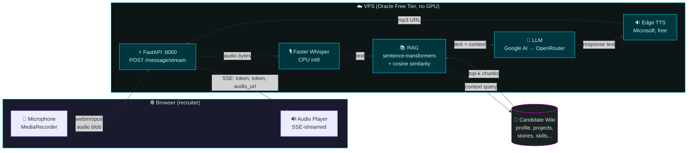

# InterviewTTS

<p align="center">
  
</p>

<p align="center">
  <strong>Voice-based AI digital twin for recruiters</strong>
</p>


> A voice-based AI digital twin that lets recruiters have real conversations with a candidate before scheduling a real interview.

Recruiters spend ~6 seconds on a CV before deciding whether to call. This project is an attempt to change that — a candidate's digital twin that talks, listens, and answers with context from their real work history and projects. The recruiter can pre-interview at any hour, hear stories in the candidate's own voice persona, and decide if it's worth the human conversation.

Built as a portfolio project to demonstrate fullstack engineering with real-time audio, RAG, multi-provider LLM orchestration, and deployment under tight constraints (Oracle Free Tier VPS, no GPU, all open-source).

---

## Why this project

The original idea was simple: make a portfolio that doesn't disappear in the 6-second CV scan. The execution went deeper — a full voice pipeline that combines speech-to-text, retrieval-augmented generation, and text-to-speech, running end-to-end in production on a free VPS.

It's not a demo. It's a deployable system with real tradeoffs, real constraints, and a real recruiter-facing UX. The code is the portfolio.

---

## Features

- **Voice input** — Browser microphone capture via MediaRecorder API, audio sent to the backend
- **Real-time streaming** — Server-Sent Events stream the LLM tokens and TTS audio URL as they're generated, so the avatar starts talking before the full response is ready
- **Speech-to-Text** — [Faster Whisper](https://github.com/SYSTRAN/faster-whisper) running CPU with int8 quantization, configurable model size (default `small`)
- **RAG pipeline** — Retrieves relevant context from the candidate's wiki (8 document types: profile, projects, experience, skills, stories, opinions, decisions, FAQ) and feeds it to the LLM
- **LLM generation** — Google AI as primary provider, [OpenRouter](https://openrouter.ai/) as fallback. System prompt positions the model as the candidate
- **Voice output** — [Edge TTS](https://github.com/rany2/edge-tts) for natural Spanish synthesis (configurable voice)
- **Audio-reactive avatar** — 3D avatar with crossfade between neutral and talking states, synchronized with the audio playback
- **Session management** — Multi-turn conversations with TTL-based cleanup
- **Rate limiting** — 10 requests per minute per IP to prevent abuse
- **Periodic audio cleanup** — Old TTS files are pruned automatically
- **Tested** — 84 tests covering config, RAG, LLM, STT, TTS, API endpoints, and conversation memory

---

## Architecture



## Data flow (per turn)

```mermaid
sequenceDiagram
    participant U as Recruiter
    participant B as Browser
    participant API as FastAPI
    participant STT as Whisper STT
    participant RAG as RAG Pipeline
    participant LLM as LLM
    participant TTS as Edge TTS

    U->>B: 🎤 Speaks (audio captured)
    B->>API: POST /api/conversation/{id}/message/stream (webm)
    API->>STT: transcribe(audio)
    STT-->>API: text "¿Cuál es tu mayor debilidad?"
    API->>RAG: retrieve(text, top_k=3)
    RAG-->>API: context chunks from wiki
    API->>LLM: prompt(system + history + context)
    LLM-->>API: "Soy muy autocrítico, tiendo a..." (streamed)
    API->>TTS: synthesize(text)
    TTS-->>API: /audio/response_xyz.mp3
    API-->>B: SSE: transcription, token*, audio_url
    B->>U: 🔊 Plays synthesized voice
    Note over API,LLM: SSE keeps latency perceived low:<br/>first token arrives before full response

    style U fill:#1a1a2e,stroke:#00f3ff,color:#dce4e4
    style B fill:#1a1a2e,stroke:#00f3ff,color:#dce4e4
    style API fill:#00363d,stroke:#00f3ff,color:#c3f5ff
    style STT fill:#0d1516,stroke:#00daf3,color:#dce4e4
    style RAG fill:#0d1516,stroke:#00daf3,color:#dce4e4
    style LLM fill:#0d1516,stroke:#00daf3,color:#dce4e4
    style TTS fill:#0d1516,stroke:#00daf3,color:#dce4e4
```

---

## Tech stack

| Layer | Technology | Why |
|---|---|---|
| Backend | Python 3.10 + FastAPI | Async-first, OpenAPI docs auto-generated, Pydantic validation |
| STT | faster-whisper (CTranslate2) | CTranslate2 is way faster than vanilla Whisper on CPU, int8 quantization keeps RAM at ~1.4 GB |
| Embeddings | sentence-transformers (all-MiniLM-L6-v2) | Small model, runs on CPU, good enough for semantic search over a small doc set |
| LLM | Google AI (Gemini) + OpenRouter | Google AI as primary (fast, cheap), OpenRouter as fallback with model flexibility |
| TTS | edge-tts | Free, no API key, runs locally, decent Spanish voices |
| Frontend | Vanilla HTML/CSS/JS | No framework overhead, faster cold start on the free tier |
| Reverse proxy | Nginx | Standard, well-documented, handles static files + WSGI proxy |
| Process manager | systemd | Auto-restart on failure, journal logging |
| Container | Docker (optional) | Reproducible builds |
| Hosting | Oracle Cloud Free Tier (ARM64) | $0/month, 4 cores, 24 GB RAM — enough for a single-conversation workload |
| Workflow | OpenSpec + strict TDD | Every change goes through spec → design → tasks → test-first → apply |

---

## Constraints and tradeoffs

This project runs on a free VPS with no GPU, so every decision is a tradeoff. Documenting them explicitly because they show how I think under constraints:

- **STT model size** — `small` Whisper hits the sweet spot for Spanish accuracy on CPU. `tiny` is faster but gets technical words wrong. `medium` is too slow. The config default is now `small`, and the test verifies it.
- **TTS voice** — Edge TTS is free and runs locally, but the voices are generic Microsoft ones, not a clone of me. Voice cloning models like Piper or ElevenLabs give better quality, but they either need a GPU or cost money. Edge TTS with streaming and caching is the best balance.
- **LLM provider** — Google AI (Gemini Flash Lite) is fast and cheap but rate-limited. OpenRouter is the fallback when the primary is unavailable.
- **VPS resources** — 4 cores and 24 GB RAM are shared with the system. Whisper alone takes ~1.4 GB, so there's no headroom for a heavy voice model. The architecture is single-conversation at a time.
- **No GPU** — All ML inference is CPU-bound. The 8-second pipeline budget is tight on CPU; the streaming endpoint is what makes the UX feel responsive.

These are documented tradeoffs, not bugs. The point is that every decision has a reason and a cost.

---

## What I learned

Building this project end-to-end forced me to learn things that aren't taught in the FP DAM curriculum:

- **FastAPI async patterns** — The bootcamp taught Flask; I needed async for streaming responses. Picked it up from the docs in a weekend.
- **Docker** — Barely mentioned in the FP. Built the Dockerfile and compose file by trial and error.
- **asyncio** — Streaming STT/RAG/LLM/TTS in sequence without async would be unbearable. Iterated from copying patterns to understanding them.
- **RAG architectures** — Designed the chunking, embedding, and retrieval strategy. Not taught in any course I took.
- **Multi-provider LLM orchestration** — Google AI as primary, OpenRouter as fallback, with graceful degradation. The pattern matters more than the providers.
- **SSE (Server-Sent Events)** — For streaming tokens and audio URLs. Different from WebSockets in tradeoffs.
- **Spec-driven development** — Every change goes through OpenSpec (proposal → spec → design → tasks → test → apply). Forces clarity before code.
- **TDD discipline** — 84 tests, all written before the production change. Strict mode means red → green, no shortcuts.
- **MCP and agent orchestration** — Built tooling around Model Context Protocol for connecting the LLM to local resources.

Beyond the tech, this project also taught me to make product decisions under constraints: prioritize what matters, defer what doesn't, document the tradeoffs.

---

## Quick start

### Prerequisites

- Python 3.10+
- pip

### Installation

```bash
git clone <repo-url>
cd InterviewTTS

python -m venv venv
source venv/bin/activate  # Linux/Mac
# or
venv\Scripts\activate  # Windows

pip install -r backend/requirements.txt
pip install pytest pytest-asyncio httpx  # for development
```

### Configuration

```bash
cp .env.example .env

# Edit .env with your API keys:
# Required: OPENROUTER_API_KEY (fallback LLM)
# Optional: GOOGLE_API_KEY (enables Google AI as primary LLM)
```

### Running

```bash
uvicorn backend.main:app --reload --host 0.0.0.0 --port 8000

# Open in browser
# http://localhost:8000
```

---

## API endpoints

| Method | Path | Description |
|---|---|---|
| `GET` | `/api/health` | Service health, including model load status |
| `GET` | `/api/config` | Public config values (no secrets) |
| `POST` | `/api/conversation` | Create new conversation session |
| `POST` | `/api/conversation/{id}/message` | Send voice message, get full response |
| `POST` | `/api/conversation/{id}/message/stream` | Streaming version: SSE events for transcription, LLM tokens, and TTS audio URL |
| `GET` | `/api/conversation/{id}/context` | Inspect the RAG context for a conversation |

The streaming endpoint is the production path. The non-streaming one is kept for tests and simple clients.

---

## Candidate profile

The digital twin is fed by a structured candidate profile that gets embedded into the RAG index:

- `candidate/profile.json` — Structured profile data (skills, experience, projects, stories)
- `candidate/docs/*.md` — Markdown documents for RAG context (CV, projects, skills, stories)

The wiki system is the source of truth for the candidate data, with a compile script that regenerates these flat files. See `wiki/CONVENCIONES.md` for the wiki conventions.

---

## Deployment

### Docker (optional)

```bash
docker compose up -d
```

### Manual (Oracle Free Tier)

1. Install system dependencies (Python 3.10, ffmpeg, nginx)
2. Configure Nginx with `nginx/interview.conf`
3. Set up systemd service with `deployment/interviewtts.service`
4. Configure `.env` with production values

---

## Project structure

```
InterviewTTS/
├── backend/
│   ├── main.py              # FastAPI application
│   ├── config.py            # Configuration management
│   ├── services/
│   │   ├── stt.py           # Speech-to-Text (Faster Whisper)
│   │   ├── llm.py           # LLM client (OpenRouter + Google AI)
│   │   ├── tts.py           # Text-to-Speech (Edge TTS)
│   │   ├── rag.py           # RAG pipeline
│   │   └── candidate.py     # Candidate profile loader
│   └── prompts/
│       └── candidate.py     # System prompt template
├── candidate/               # Profile data (RAG input)
│   ├── profile.json
│   └── docs/
├── frontend/
│   ├── index.html           # Main page
│   ├── style.css            # Styling
│   ├── app.js               # Voice chat logic
│   ├── avatar.js            # 3D avatar controller
│   └── assets/              # Avatar video files
├── tests/                   # 84 tests, strict TDD
├── docs/                    # Internal docs (optimization plans, superpowers specs)
├── openspec/                # Change management artifacts
│   ├── specs/               # Current capability specs
│   └── changes/             # In-flight and archived changes
├── nginx/                   # Nginx configuration
├── deployment/              # Systemd service files
├── .env.example             # Environment template
├── pyproject.toml
├── PLAN.md                  # Local planning doc (gitignored)
└── README.md
```

---

## Testing

84 tests covering config, RAG, LLM, STT, TTS, API endpoints, and conversation memory. Strict TDD mode: every change is red → green → refactor.

```bash
# Run all tests
python -m pytest tests/ -v

# Run specific test file
python -m pytest tests/test_rag.py -v

# Run specific test
python -m pytest tests/test_stt.py::TestSTTService::test_init_defaults -v
```

---

## License

MIT — see `LICENSE` file.
