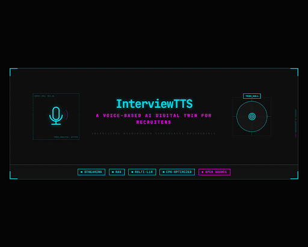
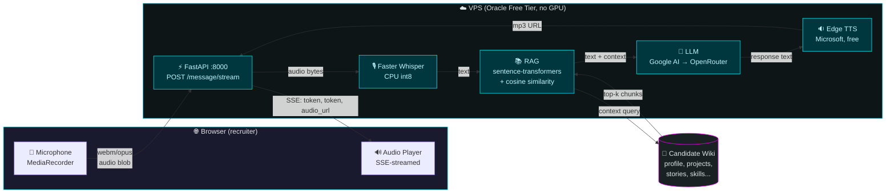
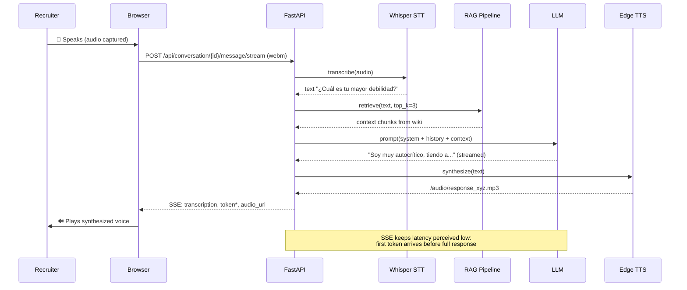

# InterviewTTS

<p align="center">
  <a href="README_ES.md">🇪🇸 Español</a> | <a href="README.md">🇬🇧 English</a>
</p>

<p align="center">
  
</p>

<p align="center">
  <strong>Recruiters spend ~6 seconds on a CV. Make them listen instead.</strong>
</p>

<p align="center">
  A voice-based AI digital twin that lets recruiters have real conversations with a candidate before scheduling a real interview.
</p>

---

## 🎯 What is this?

Recruiters spend ~6 seconds on a CV before deciding whether to call. This project is an attempt to change that — a candidate's digital twin that talks, listens, and answers with context from their real work history and projects. The recruiter can pre-interview at any hour, hear stories in the candidate's own voice persona, and decide if it's worth the human conversation.

Built as a portfolio project to demonstrate fullstack engineering with real-time audio, RAG, multi-provider LLM orchestration, and deployment under tight constraints (Oracle Free Tier VPS, no GPU, all open-source).

---

## Why this project

The original idea was simple: make a portfolio that doesn't disappear in the 6-second CV scan. The execution went deeper — a full voice pipeline that combines speech-to-text, retrieval-augmented generation, and text-to-speech, plus a reproducible deployment procedure for the hardware it targets: a $0 ARM64 VPS, no GPU, all open-source. [`scripts/deploy.sh`](scripts/deploy.sh), the systemd unit, `nginx/interview.conf` and the TLS setup script take a clean checkout to a running service, and the nginx and deploy paths are covered by the test suite.

What this repository does not record is whether any particular host is running it right now. `scripts/deploy.sh:17` defaults `VPS_HOST` to the placeholder `your-vps-hostname`, no host or address appears anywhere in the tree, and the only tag is `pre/wiki-pipeline`. So this is a deployment procedure you can run, not a link to a running instance — judge the deployability from the script and the tests, not from a claim of uptime.

It's not a demo. It's a deployable system with real tradeoffs, real constraints, and a real recruiter-facing UX. The code is the portfolio.

---

## Features

- **Voice input** — Browser microphone capture via MediaRecorder API, audio sent to the backend
- **Real-time streaming** — Server-Sent Events stream the LLM tokens and TTS audio URL as they're generated, so the avatar starts talking before the full response is ready
- **Speech-to-Text** — [Faster Whisper](https://github.com/SYSTRAN/faster-whisper) running CPU with int8 quantization, configurable model size (default `small`)
- **RAG pipeline** — Retrieves relevant context from the candidate's wiki (8 document types: profile, projects, experience, skills, stories, opinions, decisions, FAQ) and feeds it to the LLM
- **LLM generation** — Google AI as primary provider, [OpenRouter](https://openrouter.ai/) as fallback. System prompt positions the model as the candidate
- **Voice output** — [Edge TTS](https://github.com/rany2/edge-tts) (Microsoft) synthesizes every response. This is the only engine: there is no Piper, no local synthesis and no fallback chain (see `backend/services/tts.py`). The voice is `TTS_VOICE` — default `es-ES-AlvaroNeural`, declared in `.env.example:36`, read at `backend/config.py:65` and applied at `backend/main.py:95`
- **Audio-reactive avatar** — 3D avatar with crossfade between neutral and talking states, synchronized with the audio playback
- **Session management** — Multi-turn conversations with TTL-based cleanup
- **Rate limiting** — 10 requests per minute per IP to prevent abuse
- **Periodic audio cleanup** — Old TTS files are pruned automatically
- **Tested** — 1006 Python tests plus 333 Node tests covering config, RAG, LLM, STT, TTS, API endpoints, conversation memory, response cache, embedding persistence, SSE framing, the nginx TLS procedure and the deploy path

---

## Architecture


```mermaid
flowchart LR
    subgraph Browser["🌐 Browser (recruiter)"]
        Mic[🎤 Microphone<br/>MediaRecorder]
        Player[🔊 Audio Player<br/>SSE-streamed]
    end

    subgraph VPS["☁️ VPS (Oracle Free Tier, no GPU)"]
        API["⚡ FastAPI :8000<br/>POST /message/stream"]
        STT[🎙️ Faster Whisper<br/>CPU int8]
        RAG[📚 RAG<br/>sentence-transformers<br/>+ cosine similarity]
        LLM[🧠 LLM<br/>Google AI → OpenRouter]
        TTS[🔉 Edge TTS<br/>Microsoft, free]
    end

    Docs[("📄 Candidate Wiki<br/>profile, projects,<br/>stories, skills...")]

    Mic -->|"webm/opus<br/>audio blob"| API
    API -->|audio bytes| STT
    STT -->|text| RAG
    RAG -->|context query| Docs
    Docs -->|top-k chunks| RAG
    RAG -->|text + context| LLM
    LLM -->|response text| TTS
    TTS -->|mp3 URL| API
    API -->|"SSE: token, token, audio_url"| Player

    style Browser fill:#1a1a2e,stroke:#00f3ff,color:#dce4e4
    style VPS fill:#0d1516,stroke:#00daf3,color:#dce4e4
    style Docs fill:#192122,stroke:#ff00ff,color:#dce4e4
    style API fill:#00363d,stroke:#00f3ff,color:#c3f5ff
    style STT fill:#00363d,stroke:#00f3ff,color:#c3f5ff
    style RAG fill:#00363d,stroke:#00f3ff,color:#c3f5ff
    style LLM fill:#00363d,stroke:#00f3ff,color:#c3f5ff
    style TTS fill:#00363d,stroke:#00f3ff,color:#c3f5ff
```

## Data flow (per turn)


```mermaid
sequenceDiagram
    participant U as Recruiter
    participant B as Browser
    participant API as FastAPI
    participant STT as Whisper STT
    participant RAG as RAG Pipeline
    participant LLM as LLM
    participant TTS as Edge TTS

    U->>B: 🎤 Speaks (audio captured)
    B->>API: POST /api/conversation/{id}/message/stream (webm)
    API->>STT: transcribe(audio)
    STT-->>API: text "¿Cuál es tu mayor debilidad?"
    API->>RAG: retrieve(text, top_k=3)
    RAG-->>API: context chunks from wiki
    API->>LLM: prompt(system + history + context)
    LLM-->>API: "Soy muy autocrítico, tiendo a..." (streamed)
    API->>TTS: synthesize(text)
    TTS-->>API: /audio/response_xyz.mp3
    API-->>B: SSE: transcription, token*, audio_url
    B->>U: 🔊 Plays synthesized voice
    Note over API,LLM: SSE keeps latency perceived low:<br/>first token arrives before full response
```

---

## Tech stack

| Layer | Technology | Why |
| --- | --- | --- |
| Backend | Python 3.10 + FastAPI | Async-first, OpenAPI docs auto-generated, Pydantic validation |
| STT | faster-whisper (CTranslate2) | CTranslate2 is way faster than vanilla Whisper on CPU, int8 quantization keeps RAM at ~1.4 GB |
| Embeddings | sentence-transformers (paraphrase-multilingual-MiniLM-L12-v2) | Multilingual because the corpus and the questions are Spanish; the English model it replaced charged a language gap on every paraphrase. That swap **alone** — the model as the only lever touched — is recall@3 0.653 → 0.796 on the 49-question labelled set (2026-09-29). 0.816 is where **four** levers sit together: this model, the page-identity prefix, the one-chunk-per-page cut and the bodyless-heading filter. Reading it as the embedder's share of the movement overstates what the model did. ~1.1 GB RSS, CPU-only |
| LLM | Google AI (Gemini) + OpenRouter | Google AI as primary (fast, cheap), OpenRouter as fallback with model flexibility |
| TTS | Edge TTS (`edge-tts`) | No API key to configure, no GPU, no local model to ship. It is a *cloud* service — the text is sent to Microsoft — so there is no offline synthesis |
| Frontend | Vanilla HTML/CSS/JS | No framework overhead, faster cold start on the free tier |
| Reverse proxy | Nginx | Standard, well-documented: serves the static frontend and proxies the ASGI app |
| Process manager | systemd | Auto-restart on failure, journal logging |
| Hosting | Oracle Cloud Free Tier (ARM64) | $0/month, 4 cores, 24 GB RAM — enough for a single-conversation workload |
| Workflow | OpenSpec + strict TDD | Every change goes through spec → design → tasks → test-first → apply |

---

## Constraints and tradeoffs

This project runs on a free VPS with no GPU, so every decision is a tradeoff. Documenting them explicitly because they show how I think under constraints:

- **STT model size** — `small` Whisper hits the sweet spot for Spanish accuracy on CPU. `tiny` is faster but gets technical words wrong. `medium` is too slow. The config default is now `small`, and the test verifies it. What ships is `WHISPER_MODEL=small`, `WHISPER_DEVICE=cpu`, `WHISPER_COMPUTE_TYPE=int8` (`backend/config.py:60-62`); the first and third are overridable per-deployment, and the shipped combination is the one the latency numbers below were measured with.
- **TTS voice** — Edge TTS needs no key and no GPU, but it is a *cloud* service: the text leaves the VPS and is synthesized by Microsoft. The voices are generic Microsoft ones, not a clone of me. Voice cloning models like Piper or ElevenLabs give better quality, but they either need a GPU or cost money. Edge TTS with streaming and caching is the best balance.
- **LLM provider** — Google AI (Gemini Flash Lite) is fast and cheap but rate-limited. OpenRouter is the fallback when the primary is unavailable.
- **VPS resources** — 4 cores and 24 GB RAM are shared with the system. Whisper alone takes ~1.4 GB, so there's no headroom for a heavy voice model. The architecture is single-conversation at a time.
- **No GPU** — All ML inference is CPU-bound. The 8-second pipeline budget is tight on CPU; the streaming endpoint is what makes the UX feel responsive.

These are documented tradeoffs, not bugs. The point is that every decision has a reason and a cost.

---

## Performance optimizations

Every optimization targets real latency in the voice pipeline. Here's what I implemented and why:

| Optimization | Latency effect (estimated, not measured) | Technique | Risk |
| --- | --- | --- | --- |
| System prompt trimming | -0.5-1.5s | Reduced 50% of tokens, kept essential instructions | Low |
| FAQ response cache | -4-8s (hits) | 20 common questions with pre-generated answers | None |
| Cache + RAG enrichment | 0s + rich context | Instant answer enriched with wiki-sourced details | Low |
| Wiki metadata RAG | Better accuracy | Frontmatter parsing, type filtering, query enrichment | Low |
| Embedding persistence | -2-3s startup | Pre-computed embeddings saved to disk, validated on load | Medium |
| Streaming SSE | Perceived 0s | Tokens arrive before full response, avatar starts talking | None |

**No latency figure in this repository is measured, so none is quoted here.** There is
no per-turn latency telemetry. `backend/turns/streaming.py` logs the STT duration
(`:280`) and the LLM+TTS duration (`:656`), but nothing logs the gap between them —
the RAG stage — and nothing records time-to-first-token, so the per-turn total
cannot be reconstructed from a log. The "latency effect" column above is therefore
an estimate, not a measurement.

The old "~15-25s before, ~8-12s after" pair is gone for a second reason: the
"before" number describes a version of this code that no longer exists, so nothing
in the repository could reproduce it on demand.

The UI is the honest part of this. `frontend/index.html:118` shows `TTFT —` until a
turn has actually been measured, and it does not estimate in the meantime — which
is the behaviour the README should have had. Real instrumentation would be the only
way to make the estimates above checkable, and it is not in this repository.

The approach: verify with tests, document the tradeoff, and mark an estimate as an
estimate.

---

## What I learned

Building this project end-to-end forced me to learn things that aren't taught in the FP DAM curriculum:

- **FastAPI async patterns** — The bootcamp taught Flask; I needed async for streaming responses. Picked it up from the docs in a weekend.
- **Deployment** — Barely mentioned in the FP. Setting up systemd, a TLS-terminating reverse proxy, and the filesystem permissions `ProtectSystem=strict` demands, by trial and error.
- **asyncio** — Streaming STT/RAG/LLM/TTS in sequence without async would be unbearable. Iterated from copying patterns to understanding them.
- **RAG architectures** — Designed the chunking, embedding, and retrieval strategy. Not taught in any course I took.
- **Multi-provider LLM orchestration** — Google AI as primary, OpenRouter as fallback, with graceful degradation. The pattern matters more than the providers.
- **SSE (Server-Sent Events)** — For streaming tokens and audio URLs. Different from WebSockets in tradeoffs.
- **Spec-driven development** — Every change goes through OpenSpec (proposal → spec → design → tasks → test → apply). Forces clarity before code.
- **TDD discipline** — 1006 Python tests, all written before the production change. Strict mode means red → green, no shortcuts.
- **MCP and agent orchestration** — Built tooling around Model Context Protocol for connecting the LLM to local resources.

Beyond the tech, this project also taught me to make product decisions under constraints: prioritize what matters, defer what doesn't, document the tradeoffs.

---

## Quick start

### Prerequisites

- Python 3.10+
- pip

### Installation

```bash
git clone https://github.com/mikelrh-dev/liveInterviewRAG.git
cd liveInterviewRAG

python -m venv venv
source venv/bin/activate  # Linux/Mac
# or
venv\Scripts\activate  # Windows

# Runtime dependencies AND the test runner in one step, from the project
# manifest. This is what CI does (tests.yml:198); `pip install -r
# backend/requirements.txt` alone gets you the runtime but not pytest, and
# `pyproject.toml` declares the two manifests as one contract that a test
# (tests/test_packaging.py::TestManifestsDoNotDrift) keeps them from drifting.
pip install -e ".[dev]"
```

The clone directory is named after the repository (`liveInterviewRAG`), not after
this file. Any name works: the configuration anchors `BASE_DIR` to the parent of
the `backend` package, not to a fixed directory name.

### Configuration

```bash
cp .env.example .env

# Edit .env. You need at least one LLM key for the digital twin to answer:
#   GOOGLE_API_KEY      enables Google AI (Gemini), which is tried FIRST
#   OPENROUTER_API_KEY  the fallback provider, used when Google AI is
#                       absent or raises
# Neither is validated at startup (both default to empty, backend/config.py:55-56),
# so a missing or wrong key surfaces as a failed turn, not a boot error. A missing
# key is not silent, though: GET /api/config publishes a boolean saying whether
# any provider is configured, and the page says so in the transcript as soon as
# it loads — before the first turn, naming both variables and the file to edit.
# The boolean is the whole of what crosses the wire; no key is read, echoed or
# logged to produce it. A key that is present but WRONG still fails its first
# turn, because nothing here can verify a credential without spending a request
# on it.
#
# TTS_VOICE selects the Edge TTS voice; it defaults to es-ES-AlvaroNeural.
# There is deliberately no HOST key -- see "Running" below.
```

### Running

```bash
uvicorn backend.main:app --reload --host 127.0.0.1 --port 8000

# Open in browser
# http://localhost:8000
```

**The bind address is a command-line argument, and deliberately not an
environment variable.** `backend/config.py` does not read it (see the comment at
`backend/config.py:165-182`) and `.env.example` declares no `HOST` key: a
`HOST=0.0.0.0` line used to sit there as a silent no-op, so an operator reading
the example could believe they had configured an exposure the process never had.
To change the bind, change the command line.

Bind `127.0.0.1`, which is what the deployed service does
(`deployment/interviewtts.service:24`). The API should only be reachable through
the local reverse proxy: nginx terminates TLS and adds the security headers, both
of which binding `0.0.0.0` skips.

The per-IP rate limit is **not** one of them, and not nginx's either. It is
`RateLimitMiddleware` in `backend/middleware.py:110`, keying each bucket on
`resolve_client_ip(request)` — the same middleware on a `0.0.0.0` bind as on a
loopback one, so it is never bypassed by changing the bind. What the proxy
decides is *which* address that key resolves to: with `--proxy-headers` and a
loopback-restricted `--forwarded-allow-ips` (see [RUNBOOK.md](RUNBOOK.md)), every
visitor behind the proxy gets their own bucket; without them the whole internet
shares the proxy's. `nginx/interview.conf` contains no `limit_req` and is not
where the limit lives.

To reach the API from another machine while developing, use an SSH tunnel
instead of opening the bind.

---

## API endpoints

| Method | Path | Description |
| --- | --- | --- |
| `GET` | `/api/health` | Service health, including model load status |
| `GET` | `/api/config` | Public config values (no secrets) |
| `POST` | `/api/conversation` | Create new conversation session |
| `POST` | `/api/conversation/{id}/message` | Send voice message, get full response |
| `POST` | `/api/conversation/{id}/message/stream` | Streaming version: SSE events for transcription, LLM tokens, and TTS audio URL |
| `GET` | `/api/conversation/{id}/context` | Inspect the RAG context for a conversation |

The streaming endpoint is the production path. The non-streaming one is kept for tests and simple clients.

---

## Candidate profile

The digital twin is fed by a structured candidate profile that gets embedded into the RAG index:

- `candidate/profile.json` — Structured profile data (skills, experience, projects, stories)
- `candidate/docs/*.md` — Markdown documents for RAG context (CV, projects, skills, stories)

The wiki system is the source of truth for the candidate data, with a compile script that regenerates these flat files. See `wiki/CONVENCIONES.md` for the wiki conventions.

### Editing the wiki (content workflow)

`wiki/` is the hand-authored source of truth. The full edit → deploy loop:

```bash
# 1. Edit pages under wiki/ (conventions in wiki/CONVENCIONES.md)

# 2. Validate frontmatter, links, dates (read-only; exit 0/1/2)
python scripts/wiki/validate.py --wiki wiki/

# 3. Compile wiki/ -> candidate/ (atomic swap; aborts on any validation error)
python scripts/wiki/compile.py --wiki wiki/ --out candidate/

# 4. Deploy to the VPS (bash/systemd; run on-VPS or via SSH from WSL/Git-Bash):
#    validate -> compile -> rsync -> systemctl restart interviewtts.service
VPS_HOST=your-host VPS_USER=deploy ./scripts/deploy.sh
```

Notes:

- `wiki/index.md` is **AUTO-GENERATED** by `scripts/wiki/generate_index.py` — never hand-edit it.
- `deploy.sh` keeps one rollback copy on the VPS at `candidate.prev/`. Roll back with:

  ```bash
  VPS_HOST=your-host VPS_USER=deploy ./scripts/deploy.sh rollback
  ```

  This is a subcommand rather than a pasted one-liner because the obvious
  one-liner is destructive. `mv candidate candidate.broken && mv candidate.prev
  candidate` looks guarded and is not: if `candidate.prev` is absent the first
  `mv` still succeeds and the second then fails, so the command has renamed the
  live content out of the way and then reported failure. The subcommand checks
  both directories exist — in its own round trip, before anything moves — and
  puts the live tree back if the swap fails partway. The tree that was live
  before the rollback is kept at `candidate.broken/`.
- Further rollback anchors: git tag `pre/wiki-pipeline` (last pre-change commit) and an out-of-repo zip snapshot of `candidate/` taken before the change.

#### Backing up `wiki/` (manual, private repo)

`wiki/` holds personal data, and it is **tracked**: 46 files are committed under `wiki/` in
this repository and are present in `origin/main`. The `/wiki/` entry in `.gitignore`
protects none of them — gitignore only applies to files that are not already tracked, and a
tracked file stays in the history. `actions/checkout` brings them to every CI run too.

The nested repository at `wiki/.git` has its own remote, `interviewtts-wiki`, and that one
**is** private, so the backup below does land somewhere private:

```bash
cd wiki/
git add -A && git commit -m "docs: update wiki content" && git push
```

This backup is a documented manual workflow only — no automation hook is wired up.

Whether those same 46 files should also remain in this repository's public history is a
separate decision, and it is not made here.

---

## Deployment

The target is an Oracle Free Tier ARM64 VPS. There is no container image and no
compose file for this project, so every step below runs on the host.

### 1. System packages

```bash
sudo apt update
sudo apt install -y python3-venv nginx certbot rsync
```

`rsync` is not optional. `scripts/deploy.sh` uses it for every content deploy
(`deploy.sh:126` and `:133`), and it is not something a stock ARM64 image has, so
without this line the first `deploy.sh` run dies with `rsync: command not found`
on a box that otherwise deployed fine.

### 2. The service user, the code, and the venv

`deployment/interviewtts.service` names a user, a working directory and an
interpreter. None of the three exist on a fresh VPS, and no script in this
repository creates them, so they are created here:

```bash
# 1. The service account. --create-home makes /opt/interviewtts exist and
#    contain nothing yet, which is precisely what the clone in step 2 needs.
sudo useradd --system --create-home --home-dir /opt/interviewtts --shell /usr/sbin/nologin interviewtts

# 2. The code. This has to come BEFORE the venv and before the install, and the
#    order is not cosmetic:
#      - the file installed in step 4 is backend/requirements.txt, which is
#        inside this clone, so the install cannot precede the clone;
#      - git refuses to clone into a directory that already has content in it
#        ("destination path already exists and is not an empty directory"), so
#        anything that writes into /opt/interviewtts first -- a venv in
#        particular -- makes this line fail.
#    git DOES accept an existing empty directory, which is what
#    useradd --create-home left behind above. A copy instead of a clone works
#    equally well; leave the directory empty either way.
sudo git clone https://github.com/mikelrh-dev/liveInterviewRAG.git /opt/interviewtts
sudo chown -R interviewtts:interviewtts /opt/interviewtts

# 3. The venv. The unit's ExecStart is
# /opt/interviewtts/venv/bin/uvicorn, so the venv has to live INSIDE the
# directory the service owns -- there is no other interpreter on the PATH a
# systemd unit can rely on. This is after the chown above so the tree belongs to
# interviewtts and not to root.
sudo -u interviewtts python3 -m venv /opt/interviewtts/venv
sudo -u interviewtts /opt/interviewtts/venv/bin/pip install --upgrade pip

# 4. The dependencies, by ABSOLUTE path. A relative backend/requirements.txt is
#    resolved against whatever directory your shell happens to be sitting in,
#    and at this point there is no reason for it to be the one you cloned into.
sudo -u interviewtts /opt/interviewtts/venv/bin/pip install -r /opt/interviewtts/backend/requirements.txt
```

The unit's `WorkingDirectory` is `/opt/interviewtts`, so the repository root and
the venv are siblings by design rather than by accident.

### 3. The writable directories

`ProtectSystem=strict` makes the whole filesystem read-only to the service, and
`ReadWritePaths` in the unit file carves back out exactly the paths the
application writes to. **systemd fails to start the unit if an unprefixed
`ReadWritePaths` entry does not exist**, so these must exist before the first
start:

```bash
sudo mkdir -p /opt/interviewtts/audio /opt/interviewtts/data /opt/interviewtts/reports /opt/interviewtts/backend/.rag_cache /opt/interviewtts/.cache/huggingface
sudo chown -R interviewtts:interviewtts /opt/interviewtts/audio /opt/interviewtts/data /opt/interviewtts/reports /opt/interviewtts/backend/.rag_cache /opt/interviewtts/.cache
```

- `audio/` is what nginx `alias`es for generated speech and what the periodic
  sweep prunes.
- `data/` holds the SQLite store.
- `reports/` holds the Markdown transcripts.
- `backend/.rag_cache/` holds the persisted embeddings. It is gitignored, so a
  clone never creates it, and the unit names it in `ReadWritePaths` without a
  `-` prefix. If it is missing the service does not start -- and that is the
  point. When the directory IS there but is not writable, the failure is much
  worse: `RAGPipeline` catches the `OSError`, logs a warning
  (`backend/services/rag.py:768`) and re-embeds the whole corpus, at every
  single boot, invisibly.
- `.cache/huggingface/` is where the embedding model is cached. The unit
  declares it as `-/opt/interviewtts/.cache/huggingface`, with systemd's
  "ignore if missing" prefix, because this directory comes into existence on its
  own the first time the model is downloaded -- requiring it would restart-loop a
  fresh install until someone created a HuggingFace-internal path by hand. It is
  created here anyway so that first download lands in a directory that already
  belongs to the service user.

### 4. Configuration

```bash
sudo cp /opt/interviewtts/.env.example /opt/interviewtts/.env
sudo chown interviewtts:interviewtts /opt/interviewtts/.env
sudo -u interviewtts nano /opt/interviewtts/.env   # API keys, CORS_ORIGINS
```

The unit reads this file via `EnvironmentFile=`, so a wrong owner or a missing
newline on the last line stops the service from starting.

### 5. nginx

Follow the order in the header of `nginx/interview.conf` — obtain the
certificate first, then install the file and `systemctl enable --now nginx`.
The header states the exact path each step produces, and
`tests/test_nginx_cert_procedure.py` fails if the documented command and the
`ssl_certificate` directive stop naming the same file.

### 6. The service

```bash
sudo cp /opt/interviewtts/deployment/interviewtts.service /etc/systemd/system/
sudo systemctl daemon-reload
sudo systemctl enable --now interviewtts
sudo systemctl status interviewtts
sudo journalctl -u interviewtts -f
```

### 7. Content deploys

`scripts/deploy.sh` rsyncs `candidate/` **and `frontend/`** (the directory nginx
serves the site from), creates the three writable directories, and restarts the
unit. See [Editing the wiki](#editing-the-wiki-content-workflow) for the
validate → compile → deploy loop and the rollback.

---

## Project structure

```
<repo>/                      # Cloned as liveInterviewRAG; the name is not load-bearing
├── backend/
│   ├── main.py              # FastAPI application
│   ├── config.py            # Configuration management
│   ├── container.py         # Service wiring / injection point
│   ├── middleware.py        # Body-size limit + per-IP rate limit
│   ├── client_ip.py         # Trusted-proxy client address resolution
│   ├── sse.py               # SSE framing and keep-alive
│   ├── services/
│   │   ├── stt.py           # Speech-to-Text (Faster Whisper)
│   │   ├── llm.py           # LLM client (Google AI first, OpenRouter fallback)
│   │   ├── tts.py           # Text-to-Speech (Edge TTS only — the sole engine)
│   │   ├── rag.py           # RAG pipeline with embedding persistence
│   │   ├── candidate.py     # Candidate profile loader (wiki/ source)
│   │   ├── persistence.py   # SQLite write-through store
│   │   ├── report.py        # Markdown transcript generation
│   │   └── response_cache.py # FAQ response cache for instant answers
│   ├── routers/             # HTTP transport: conversations, turns, system
│   ├── turns/               # The turn itself: blocking, streaming, answer source
│   └── prompts/
│       └── candidate.py     # System prompt template
├── candidate/               # Profile data (RAG input)
│   ├── profile.json
│   └── docs/
├── wiki/                    # Source of truth for candidate data
│   ├── profile/
│   ├── projects/
│   ├── experience/
│   ├── skills/
│   ├── stories/
│   ├── opinions/
│   ├── decisions/
│   └── faq/
├── frontend/
│   ├── index.html           # Main page
│   ├── style.css            # Styling
│   ├── app.js               # Voice chat logic
│   ├── avatar.js            # 3D avatar controller
│   └── assets/              # Avatar video files
├── tests/                   # 1006 Python tests + 333 Node tests, strict TDD
├── docs/                    # Internal docs (optimization plans, superpowers specs)
├── openspec/                # Change management artifacts
│   ├── specs/               # Current capability specs
│   └── changes/             # In-flight and archived changes
├── nginx/                   # Nginx configuration (interview.conf)
├── deployment/              # Systemd unit file (interviewtts.service)
├── scripts/                 # Wiki validate/compile/index + deploy.sh
├── .env.example             # Environment template
├── pyproject.toml
├── PLAN.md                  # Local planning doc (gitignored)
└── README.md
```

---

## Testing

1006 Python tests covering config, RAG, LLM, STT, TTS, API endpoints, conversation
memory, response cache, embedding persistence, SSE framing, the nginx TLS
procedure and the deploy path — plus 333 Node tests over the SSE contract, turn
state, tokens and motion. Strict TDD mode: every change is red → green →
refactor.

```bash
# Run all Python tests. Use the venv interpreter: the global Python has no
# pydantic.
venv\Scripts\python.exe -m pytest tests/ -q --no-header -p no:cacheprovider
# -> 1006 passed in 576.44s

# Run a specific test file, or a single test
venv\Scripts\python.exe -m pytest tests/test_rag.py -q -p no:cacheprovider
venv\Scripts\python.exe -m pytest tests/test_stt.py::TestSTTService::test_init_defaults -v

# Frontend tests (Node, no build step)
node --test "tests/frontend/*.test.mjs"
# -> 333 pass
```

> **Environment trap.** If an earlier terminal exported
> `PYTEST_DISABLE_PLUGIN_AUTOLOAD=1`, the `pytest-asyncio` plugin stops loading
> and a batch of async tests fail spuriously. Clear it first:
>
> ```powershell
> Remove-Item Env:PYTEST_DISABLE_PLUGIN_AUTOLOAD -ErrorAction SilentlyContinue
> ```

See [RUNBOOK.md](RUNBOOK.md) for the day-to-day local workflow.


---

## License

MIT — see `LICENSE` file.
