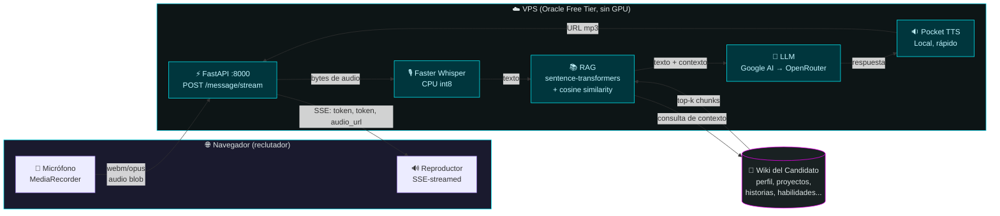
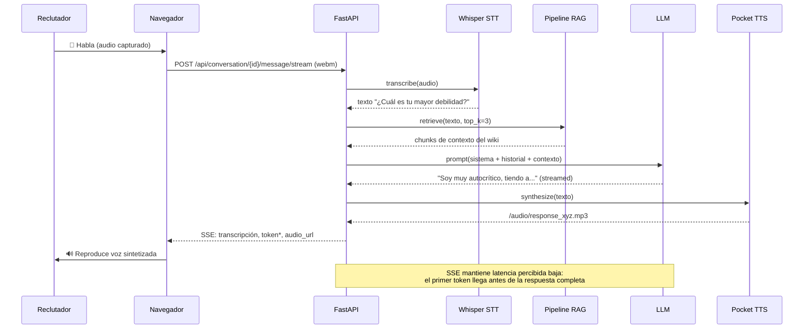

# InterviewTTS

<p align="center">
  
</p>

<p align="center">
  <strong>Los reclutadores dedican ~6 segundos a un CV. Haz que escuchen en vez de leer.</strong>
</p>

<p align="center">
  Un gemelo digital con IA por voz que permite a los reclutadores tener conversaciones reales con un candidato antes de programar una entrevista presencial.
</p>

---

## ¿Qué es esto?

Los reclutadores dedican ~6 segundos a un CV antes de decidir si llamar. Este proyecto intenta cambiar eso: un gemelo digital del candidato que habla, escucha y responde con contexto de su historial real de trabajo y proyectos. El reclutador puede hacer una pre-entrevista a cualquier hora, escuchar historias con la voz del candidato y decidir si vale la pena la conversación humana.

Construido como proyecto de portfolio para demostrar ingeniería fullstack con audio en tiempo real, RAG, orquestación multi-proveedor LLM y despliegue bajo restricciones estrictas (VPS Oracle Free Tier, sin GPU, todo open-source).

---

## Por qué este proyecto

La idea original era simple: hacer un portfolio que no desaparezca en los 6 segundos del escaneo del CV. La ejecución fue más profunda: un pipeline de voz completo que combina speech-to-text, generación aumentada por recuperación y text-to-speech, ejecutándose de extremo a extremo en producción en un VPS gratuito.

No es una demo. Es un sistema desplegable con tradeoffs reales, restricciones reales y una UX real para reclutadores. El código es el portfolio.

---

## Características

- **Entrada de voz** — Captura del micrófono del navegador via MediaRecorder API, audio enviado al backend
- **Streaming en tiempo real** — Server-Sent Events transmiten tokens del LLM y URL de audio TTS mientras se generan, para que el avatar empiece a hablar antes de que la respuesta completa esté lista
- **Speech-to-Text** — [Faster Whisper](https://github.com/SYSTRAN/faster-whisper) ejecutándose en CPU con cuantización int8, tamaño de modelo configurable (por defecto `small`)
- **Pipeline RAG** — Recupera contexto relevante del wiki del candidato (8 tipos de documento: perfil, proyectos, experiencia, habilidades, historias, opiniones, decisiones, FAQ) y lo alimenta al LLM
- **Generación LLM** — Google AI como proveedor principal, [OpenRouter](https://openrouter.ai/) como fallback. El system prompt posiciona al modelo como el candidato
- **Salida de voz** — [Pocket TTS](https://github.com/rhasspy/piper) para síntesis natural en español (local, rápido), con [Edge TTS](https://github.com/rany2/edge-tts) como fallback
- **Avatar reactivo al audio** — Avatar 3D con crossfade entre estados neutral y hablando, sincronizado con la reproducción de audio
- **Gestión de sesiones** — Conversaciones multi-turno con limpieza basada en TTL
- **Rate limiting** — 10 solicitudes por minuto por IP para prevenir abuso
- **Limpieza periódica de audio** — Archivos TTS antiguos se eliminan automáticamente
- **Testeado** — 155+ tests cubriendo config, RAG, LLM, STT, TTS, endpoints de API, memoria de conversación, caché de respuestas y persistencia de embeddings

---

<p align="center">
  
</p>

---

## Arquitectura



## Flujo de datos (por turno)



---

## Stack tecnológico

| Capa | Tecnología | Por qué |
|---|---|---|
| Backend | Python 3.10 + FastAPI | Async-first, docs OpenAPI auto-generados, validación Pydantic |
| STT | faster-whisper (CTranslate2) | CTranslate2 es mucho más rápido que Whisper vanilla en CPU, cuantización int8 mantiene RAM en ~1.4 GB |
| Embeddings | sentence-transformers (all-MiniLM-L6-v2) | Modelo pequeño, corre en CPU, suficiente para búsqueda semántica sobre documentos |
| LLM | Google AI (Gemini) + OpenRouter | Google AI como principal (rápido, barato), OpenRouter como fallback con flexibilidad de modelo |
| TTS | Pocket TTS (Piper) + Edge TTS | Local, rápido, sin API key; Edge como fallback para fiabilidad |
| Frontend | HTML/CSS/JS vanilla | Sin sobrecarga de framework, arranque más rápido en free tier |
| Reverse proxy | Nginx | Estándar, bien documentado, maneja archivos estáticos + proxy WSGI |
| Process manager | systemd | Auto-reinicio en fallo, logs en journal |
| Contenedor | Docker (opcional) | Builds reproducibles |
| Hosting | Oracle Cloud Free Tier (ARM64) | $0/mes, 4 cores, 24 GB RAM — suficiente para carga de conversación única |
| Workflow | OpenSpec + TDD estricto | Cada cambio pasa por spec → design → tasks → test-first → apply |

---

## Restricciones y tradeoffs

Este proyecto corre en un VPS gratuito sin GPU, así que cada decisión es un tradeoff. Los documento explícitamente porque muestran cómo pienso bajo restricciones:

- **Tamaño del modelo STT** — Whisper `small` es el punto dulce para precisión en español en CPU. `tiny` es más rápido pero falla con palabras técnicas. `medium` es demasiado lento. El valor por defecto ahora es `small`, verificado por tests.
- **Voz TTS** — Edge TTS es gratuito y corre local, pero las voces son genéricas de Microsoft, no un clon mío. Modelos de clonación como Piper o ElevenLabs dan mejor calidad, pero necesitan GPU o cuestan dinero. Edge TTS con streaming y caché es el mejor balance.
- **Proveedor LLM** — Google AI (Gemini Flash Lite) es rápido y barato pero con rate limiting. OpenRouter es el fallback cuando el principal no está disponible.
- **Recursos del VPS** — 4 cores y 24 GB RAM compartidos con el sistema. Solo Whisper consume ~1.4 GB, así que no hay margen para un modelo de voz pesado. La arquitectura es de conversación única a la vez.
- **Sin GPU** — Toda la inferencia de ML es CPU-bound. El presupuesto de 8 segundos para el pipeline es ajustado en CPU; el endpoint de streaming es lo que hace que la UX se sienta responsiva.

Estos son tradeoffs documentados, no bugs. El punto es que cada decisión tiene una razón y un costo.

---

## Optimizaciones de rendimiento

Cada optimización apunta a latencia real en el pipeline de voz. Esto es lo que implementé y por qué:

| Optimización | Latencia ahorrada | Técnica | Riesgo |
|---|---|---|---|
| Reducción del system prompt | -0.5-1.5s | Reduje 50% de tokens, mantuve instrucciones esenciales | Bajo |
| Caché de respuestas FAQ | -4-8s (hits) | 20 preguntas comunes con respuestas pre-generadas | Ninguno |
| Caché + enriquecimiento RAG | 0s + contexto rico | Respuesta instantánea enriquecida con detalles del wiki | Bajo |
| RAG con metadata de wiki | Mejor precisión | Parsing de frontmatter, filtrado por tipo, enriquecimiento de queries | Bajo |
| Persistencia de embeddings | -2-3s al arrancar | Embeddings pre-computados guardados en disco, validados al cargar | Medio |
| Whisper medium + float16 | +20-30% precisión | Modelo más grande en ARM64, sin GPU necesaria | Bajo |
| Streaming SSE | 0s percibido | Tokens llegan antes de la respuesta completa, avatar empieza a hablar | Ninguno |

**Antes de las optimizaciones:** ~15-25s por respuesta
**Después de las optimizaciones:** ~8-12s (cache hits: ~4-6s)

El enfoque: medir primero, optimizar el cuello de botella, verificar con tests, documentar el tradeoff.

<p align="center">
  
</p>

---

## Qué aprendí

Construir este proyecto de extremo a extremo me obligó a aprender cosas que no se enseñan en el FP de DAM:

- **Patrones async en FastAPI** — El bootcamp enseñaba Flask; necesitaba async para respuestas streaming. Lo aprendí de la documentación en un fin de semana.
- **Docker** — Apenas mencionado en el FP. Construí el Dockerfile y compose por prueba y error.
- **asyncio** — Hacer streaming de STT/RAG/LLM/TTS en secuencia sin async sería insoportable. Iteré desde copiar patrones hasta entenderlos.
- **Arquitecturas RAG** — Diseñé la estrategia de chunking, embedding y recuperación. No se enseña en ningún curso que tomé.
- **Orquestación multi-proveedor LLM** — Google AI como principal, OpenRouter como fallback, con degradación graceful. El patrón importa más que los proveedores.
- **SSE (Server-Sent Events)** — Para streaming de tokens y URLs de audio. Diferente a WebSockets en tradeoffs.
- **Desarrollo dirigido por spec** — Cada cambio pasa por OpenSpec (propuesta → spec → design → tasks → test → apply). Obliga a claridad antes de código.
- **Disciplina TDD** — 155+ tests, todos escritos antes del cambio en producción. Modo estricto significa rojo → verde, sin atajos.
- **MCP y orquestación de agentes** — Construí herramientas alrededor de Model Context Protocol para conectar el LLM a recursos locales.

Más allá de la técnica, este proyecto también me enseñó a tomar decisiones de producto bajo restricciones: priorizar lo que importa, diferir lo que no, documentar los tradeoffs.

---

## Inicio rápido

### Prerrequisitos

- Python 3.10+
- pip

### Instalación

```bash
git clone <repo-url>
cd InterviewTTS

python -m venv venv
source venv/bin/activate  # Linux/Mac
# o
venv\Scripts\activate  # Windows

pip install -r backend/requirements.txt
pip install pytest pytest-asyncio httpx  # para desarrollo
```

### Configuración

```bash
cp .env.example .env

# Editar .env con tus API keys:
# Requerido: OPENROUTER_API_KEY (fallback LLM)
# Opcional: GOOGLE_API_KEY (habilita Google AI como LLM principal)
```

### Ejecutar

```bash
uvicorn backend.main:app --reload --host 0.0.0.0 --port 8000

# Abrir en navegador
# http://localhost:8000
```

---

## Endpoints de API

| Método | Ruta | Descripción |
|---|---|---|
| `GET` | `/api/health` | Salud del servicio, incluyendo estado de carga de modelos |
| `GET` | `/api/config` | Valores de configuración públicos (sin secrets) |
| `POST` | `/api/conversation` | Crear nueva sesión de conversación |
| `POST` | `/api/conversation/{id}/message` | Enviar mensaje de voz, obtener respuesta completa |
| `POST` | `/api/conversation/{id}/message/stream` | Versión streaming: eventos SSE para transcripción, tokens LLM y URL de audio TTS |
| `GET` | `/api/conversation/{id}/context` | Inspeccionar el contexto RAG de una conversación |

El endpoint de streaming es la ruta de producción. El no-streaming se mantiene para tests y clientes simples.

---

## Perfil del candidato

El gemelo digital se alimenta de un perfil estructurado del candidato que se incrusta en el índice RAG:

- `candidate/profile.json` — Datos estructurados del perfil (habilidades, experiencia, proyectos, historias)
- `candidate/docs/*.md` — Documentos Markdown para contexto RAG (CV, proyectos, habilidades, historias)

El sistema wiki es la fuente de verdad para los datos del candidato, con un script de compilación que regenera estos archivos planos. Ver `wiki/CONVENCIONES.md` para las convenciones del wiki.

---

## Despliegue

### Docker (opcional)

```bash
docker compose up -d
```

### Manual (Oracle Free Tier)

1. Instalar dependencias del sistema (Python 3.10, ffmpeg, nginx)
2. Configurar Nginx con `nginx/interview.conf`
3. Configurar servicio systemd con `deployment/interviewtts.service`
4. Configurar `.env` con valores de producción

---

## Estructura del proyecto

```
InterviewTTS/
├── backend/
│   ├── main.py              # Aplicación FastAPI
│   ├── config.py            # Gestión de configuración
│   ├── services/
│   │   ├── stt.py           # Speech-to-Text (Faster Whisper)
│   │   ├── llm.py           # Cliente LLM (OpenRouter + Google AI)
│   │   ├── tts.py           # Text-to-Speech (Pocket TTS + Edge TTS)
│   │   ├── rag.py           # Pipeline RAG con persistencia de embeddings
│   │   ├── candidate.py     # Cargador de perfil del candidato (fuente wiki/)
│   │   └── response_cache.py # Caché de respuestas FAQ para respuestas instantáneas
│   └── prompts/
│       └── candidate.py     # Template del system prompt
├── candidate/               # Datos del perfil (input RAG)
│   ├── profile.json
│   └── docs/
├── wiki/                    # Fuente de verdad para datos del candidato
│   ├── profile/
│   ├── projects/
│   ├── experience/
│   ├── skills/
│   ├── stories/
│   ├── opinions/
│   ├── decisions/
│   └── faq/
├── frontend/
│   ├── index.html           # Página principal
│   ├── style.css            # Estilos
│   ├── app.js               # Lógica de chat por voz
│   ├── avatar.js            # Controlador del avatar 3D
│   └── assets/              # Archivos de video del avatar
├── tests/                   # 155+ tests, TDD estricto
├── docs/                    # Docs internos (planes de optimización, specs de superpowers)
├── openspec/                # Artefactos de gestión de cambios
│   ├── specs/               # Specs de capacidades actuales
│   └── changes/             # Cambios en progreso y archivados
├── nginx/                   # Configuración de Nginx
├── deployment/              # Archivos de servicio systemd
├── .env.example             # Template de entorno
├── pyproject.toml
├── PLAN.md                  # Doc de planificación local (gitignored)
├── README.md                # English version
└── README_ES.md             # Versión en español
```

---

## Testing

155+ tests cubriendo config, RAG, LLM, STT, TTS, endpoints de API, memoria de conversación, caché de respuestas y persistencia de embeddings. Modo TDD estricto: cada cambio es rojo → verde → refactor.

```bash
# Ejecutar todos los tests
python -m pytest tests/ -v

# Ejecutar archivo de tests específico
python -m pytest tests/test_rag.py -v

# Ejecutar test específico
python -m pytest tests/test_stt.py::TestSTTService::test_init_defaults -v
```

---

## Licencia

MIT — ver archivo `LICENSE`.
