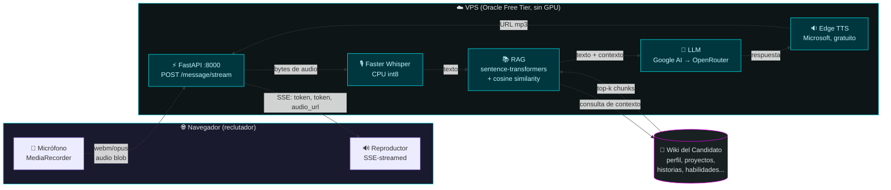
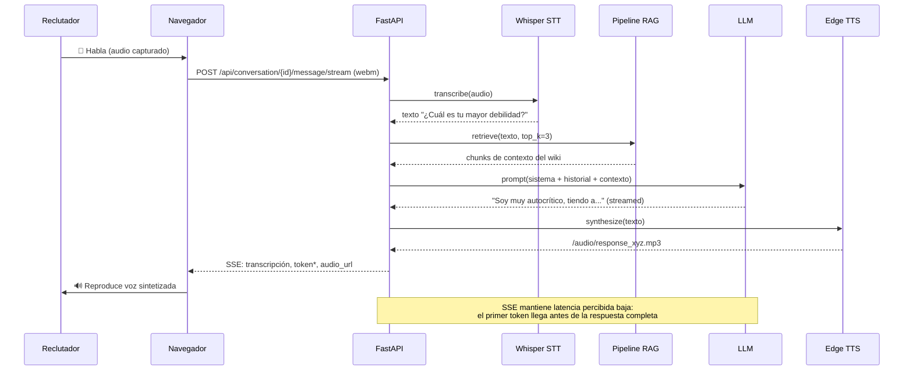

# InterviewTTS

<p align="center">
  <a href="README_ES.md">🇪🇸 Español</a> | <a href="README.md">🇬🇧 English</a>
</p>

<p align="center">
  
</p>

<p align="center">
  <strong>Los reclutadores dedican ~6 segundos a un CV. Haz que escuchen en vez de leer.</strong>
</p>

<p align="center">
  Un gemelo digital con IA por voz que permite a los reclutadores tener conversaciones reales con un candidato antes de programar una entrevista presencial.
</p>

---

## ¿Qué es esto?

Los reclutadores dedican ~6 segundos a un CV antes de decidir si llamar. Este proyecto intenta cambiar eso: un gemelo digital del candidato que habla, escucha y responde con contexto de su historial real de trabajo y proyectos. El reclutador puede hacer una pre-entrevista a cualquier hora, escuchar historias con la voz del candidato y decidir si vale la pena la conversación humana.

Construido como proyecto de portfolio para demostrar ingeniería fullstack con audio en tiempo real, RAG, orquestación multi-proveedor LLM y despliegue bajo restricciones estrictas (VPS Oracle Free Tier, sin GPU, todo open-source).

---

## Por qué este proyecto

La idea original era simple: hacer un portfolio que no desaparezca en los 6 segundos del escaneo del CV. La ejecución fue más profunda: un pipeline de voz completo que combina speech-to-text, generación aumentada por recuperación y text-to-speech, ejecutándose de extremo a extremo en producción en un VPS gratuito.

No es una demo. Es un sistema desplegable con tradeoffs reales, restricciones reales y una UX real para reclutadores. El código es el portfolio.

---

## Características

- **Entrada de voz** — Captura del micrófono del navegador via MediaRecorder API, audio enviado al backend
- **Streaming en tiempo real** — Server-Sent Events transmiten tokens del LLM y URL de audio TTS mientras se generan, para que el avatar empiece a hablar antes de que la respuesta completa esté lista
- **Speech-to-Text** — [Faster Whisper](https://github.com/SYSTRAN/faster-whisper) ejecutándose en CPU con cuantización int8, tamaño de modelo configurable (por defecto `small`)
- **Pipeline RAG** — Recupera contexto relevante del wiki del candidato (8 tipos de documento: perfil, proyectos, experiencia, habilidades, historias, opiniones, decisiones, FAQ) y lo alimenta al LLM
- **Generación LLM** — Google AI como proveedor principal, [OpenRouter](https://openrouter.ai/) como fallback. El system prompt posiciona al modelo como el candidato
- **Salida de voz** — [Edge TTS](https://github.com/rany2/edge-tts) (Microsoft) sintetiza cada respuesta. Es el único motor: no hay Piper, no hay síntesis local ni cadena de fallback (ver `backend/services/tts.py`). La voz es `TTS_VOICE` — por defecto `es-ES-AlvaroNeural`, declarada en `.env.example:36`, leída en `backend/config.py:65` y aplicada en `backend/main.py:95`
- **Avatar reactivo al audio** — Avatar 3D con crossfade entre estados neutral y hablando, sincronizado con la reproducción de audio
- **Gestión de sesiones** — Conversaciones multi-turno con limpieza basada en TTL
- **Rate limiting** — 10 solicitudes por minuto por IP para prevenir abuso
- **Limpieza periódica de audio** — Archivos TTS antiguos se eliminan automáticamente
- **Testeado** — 878 tests de Python más 277 tests de Node cubriendo config, RAG, LLM, STT, TTS, endpoints de API, memoria de conversación, caché de respuestas, persistencia de embeddings, framing SSE, el procedimiento TLS de nginx y la ruta de despliegue

---

<p align="center">
  
</p>

---

## Arquitectura


```mermaid
flowchart LR
    subgraph Browser["🌐 Navegador (reclutador)"]
        Mic[🎤 Micrófono<br/>MediaRecorder]
        Player[🔊 Reproductor<br/>SSE-streamed]
    end

    subgraph VPS["☁️ VPS (Oracle Free Tier, sin GPU)"]
        API["⚡ FastAPI :8000<br/>POST /message/stream"]
        STT[🎙️ Faster Whisper<br/>CPU int8]
        RAG[📚 RAG<br/>sentence-transformers<br/>+ cosine similarity]
        LLM[🧠 LLM<br/>Google AI → OpenRouter]
        TTS[🔉 Edge TTS<br/>Microsoft, gratuito]
    end

    Docs[("📄 Wiki del Candidato<br/>perfil, proyectos,<br/>historias, habilidades...")]

    Mic -->|"webm/opus<br/>audio blob"| API
    API -->|bytes de audio| STT
    STT -->|texto| RAG
    RAG -->|consulta de contexto| Docs
    Docs -->|top-k chunks| RAG
    RAG -->|texto + contexto| LLM
    LLM -->|respuesta| TTS
    TTS -->|URL mp3| API
    API -->|"SSE: token, token, audio_url"| Player

    style Browser fill:#1a1a2e,stroke:#00f3ff,color:#dce4e4
    style VPS fill:#0d1516,stroke:#00daf3,color:#dce4e4
    style Docs fill:#192122,stroke:#ff00ff,color:#dce4e4
    style API fill:#00363d,stroke:#00f3ff,color:#c3f5ff
    style STT fill:#00363d,stroke:#00f3ff,color:#c3f5ff
    style RAG fill:#00363d,stroke:#00f3ff,color:#c3f5ff
    style LLM fill:#00363d,stroke:#00f3ff,color:#c3f5ff
    style TTS fill:#00363d,stroke:#00f3ff,color:#c3f5ff
```

## Flujo de datos (por turno)


```mermaid
sequenceDiagram
    participant U as Reclutador
    participant B as Navegador
    participant API as FastAPI
    participant STT as Whisper STT
    participant RAG as Pipeline RAG
    participant LLM as LLM
    participant TTS as Edge TTS

    U->>B: 🎤 Habla (audio capturado)
    B->>API: POST /api/conversation/{id}/message/stream (webm)
    API->>STT: transcribe(audio)
    STT-->>API: texto "¿Cuál es tu mayor debilidad?"
    API->>RAG: retrieve(texto, top_k=3)
    RAG-->>API: chunks de contexto del wiki
    API->>LLM: prompt(sistema + historial + contexto)
    LLM-->>API: "Soy muy autocrítico, tiendo a..." (streamed)
    API->>TTS: synthesize(texto)
    TTS-->>API: /audio/response_xyz.mp3
    API-->>B: SSE: transcripción, token*, audio_url
    B->>U: 🔊 Reproduce voz sintetizada
    Note over API,LLM: SSE mantiene latencia percibida baja:<br/>el primer token llega antes de la respuesta completa
```

---

## Stack tecnológico

| Capa | Tecnología | Por qué |
|---|---|---|
| Backend | Python 3.10 + FastAPI | Async-first, docs OpenAPI auto-generados, validación Pydantic |
| STT | faster-whisper (CTranslate2) | CTranslate2 es mucho más rápido que Whisper vanilla en CPU, cuantización int8 mantiene RAM en ~1.4 GB |
| Embeddings | sentence-transformers (paraphrase-multilingual-MiniLM-L12-v2) | Multilingüe porque el corpus y las preguntas están en español; el modelo inglés al que sustituye pagaba una brecha de idioma en cada paráfrasis (recall@3 0,653 → 0,816 sobre las 49 preguntas etiquetadas). ~1,1 GB RSS, solo CPU |
| LLM | Google AI (Gemini) + OpenRouter | Google AI como principal (rápido, barato), OpenRouter como fallback con flexibilidad de modelo |
| TTS | Edge TTS (`edge-tts`) | Sin API key que configurar, sin GPU, sin modelo local que desplegar. Es un servicio *en la nube* — el texto se envía a Microsoft — así que no hay síntesis offline |
| Frontend | HTML/CSS/JS vanilla | Sin sobrecarga de framework, arranque más rápido en free tier |
| Reverse proxy | Nginx | Estándar, bien documentado: sirve el frontend estático y hace proxy a la app ASGI |
| Process manager | systemd | Auto-reinicio en fallo, logs en journal |
| Hosting | Oracle Cloud Free Tier (ARM64) | $0/mes, 4 cores, 24 GB RAM — suficiente para carga de conversación única |
| Workflow | OpenSpec + TDD estricto | Cada cambio pasa por spec → design → tasks → test-first → apply |

---

## Restricciones y tradeoffs

Este proyecto corre en un VPS gratuito sin GPU, así que cada decisión es un tradeoff. Los documento explícitamente porque muestran cómo pienso bajo restricciones:

- **Tamaño del modelo STT** — Whisper `small` es el punto dulce para precisión en español en CPU. `tiny` es más rápido pero falla con palabras técnicas. `medium` es demasiado lento. El valor por defecto ahora es `small`, verificado por tests. Lo que se envía es `WHISPER_MODEL=small`, `WHISPER_DEVICE=cpu`, `WHISPER_COMPUTE_TYPE=int8` (`backend/config.py:60-62`); el primero y el tercero son sobrescribibles por despliegue, y la combinación enviada es la con la que se midieron las cifras de latencia de más abajo.
- **Voz TTS** — Edge TTS no necesita key ni GPU, pero es un servicio *en la nube*: el texto sale del VPS y lo sintetiza Microsoft. Las voces son genéricas de Microsoft, no un clon mío. Los modelos de clonación como Piper o ElevenLabs dan mejor calidad, pero necesitan GPU o cuestan dinero. Edge TTS con streaming y caché es el mejor balance.
- **Proveedor LLM** — Google AI (Gemini Flash Lite) es rápido y barato pero con rate limiting. OpenRouter es el fallback cuando el principal no está disponible.
- **Recursos del VPS** — 4 cores y 24 GB RAM compartidos con el sistema. Solo Whisper consume ~1.4 GB, así que no hay margen para un modelo de voz pesado. La arquitectura es de conversación única a la vez.
- **Sin GPU** — Toda la inferencia de ML es CPU-bound. El presupuesto de 8 segundos para el pipeline es ajustado en CPU; el endpoint de streaming es lo que hace que la UX se sienta responsiva.

Estos son tradeoffs documentados, no bugs. El punto es que cada decisión tiene una razón y un costo.

---

## Optimizaciones de rendimiento

Cada optimización apunta a latencia real en el pipeline de voz. Esto es lo que implementé y por qué:

| Optimización | Latencia ahorrada | Técnica | Riesgo |
|---|---|---|---|
| Reducción del system prompt | -0.5-1.5s | Reduje 50% de tokens, mantuve instrucciones esenciales | Bajo |
| Caché de respuestas FAQ | -4-8s (hits) | 20 preguntas comunes con respuestas pre-generadas | Ninguno |
| Caché + enriquecimiento RAG | 0s + contexto rico | Respuesta instantánea enriquecida con detalles del wiki | Bajo |
| RAG con metadata de wiki | Mejor precisión | Parsing de frontmatter, filtrado por tipo, enriquecimiento de queries | Bajo |
| Persistencia de embeddings | -2-3s al arrancar | Embeddings pre-computados guardados en disco, validados al cargar | Medio |
| Streaming SSE | 0s percibido | Tokens llegan antes de la respuesta completa, avatar empieza a hablar | Ninguno |

**Antes de las optimizaciones:** ~15-25s por respuesta
**Después de las optimizaciones:** ~8-12s (cache hits: ~4-6s)

El enfoque: medir primero, optimizar el cuello de botella, verificar con tests, documentar el tradeoff.

<p align="center">
  
</p>

---

## Qué aprendí

Construir este proyecto de extremo a extremo me obligó a aprender cosas que no se enseñan en el FP de DAM:

- **Patrones async en FastAPI** — El bootcamp enseñaba Flask; necesitaba async para respuestas streaming. Lo aprendí de la documentación en un fin de semana.
- **Despliegue** — Apenas mencionado en el FP. Configurar systemd, un reverse proxy que termina el TLS y los permisos de filesystem que `ProtectSystem=strict` exige, a base de prueba y error.
- **asyncio** — Hacer streaming de STT/RAG/LLM/TTS en secuencia sin async sería insoportable. Iteré desde copiar patrones hasta entenderlos.
- **Arquitecturas RAG** — Diseñé la estrategia de chunking, embedding y recuperación. No se enseña en ningún curso que tomé.
- **Orquestación multi-proveedor LLM** — Google AI como principal, OpenRouter como fallback, con degradación graceful. El patrón importa más que los proveedores.
- **SSE (Server-Sent Events)** — Para streaming de tokens y URLs de audio. Diferente a WebSockets en tradeoffs.
- **Desarrollo dirigido por spec** — Cada cambio pasa por OpenSpec (propuesta → spec → design → tasks → test → apply). Obliga a claridad antes de código.
- **Disciplina TDD** — 878 tests de Python, todos escritos antes del cambio en producción. Modo estricto significa rojo → verde, sin atajos.
- **MCP y orquestación de agentes** — Construí herramientas alrededor de Model Context Protocol para conectar el LLM a recursos locales.

Más allá de la técnica, este proyecto también me enseñó a tomar decisiones de producto bajo restricciones: priorizar lo que importa, diferir lo que no, documentar los tradeoffs.

---

## Inicio rápido

### Prerrequisitos

- Python 3.10+
- pip

### Instalación

```bash
git clone https://github.com/mikelrh-dev/liveInterviewRAG.git
cd liveInterviewRAG

python -m venv venv
source venv/bin/activate  # Linux/Mac
# o
venv\Scripts\activate  # Windows

# Dependencias de runtime Y el runner de tests en un solo paso, desde el
# manifiesto del proyecto. Esto es lo que hace CI (tests.yml:174);
# `pip install -r backend/requirements.txt` por su cuenta te da el runtime
# pero no pytest, y `pyproject.toml` declara los dos manifiestos como un
# contrato que un test (tests/test_packaging.py::TestManifestsDoNotDrift)
# mantiene sin que se desvíen.
pip install -e ".[dev]"
```

El directorio del clone se llama como el repositorio (`liveInterviewRAG`), no como
este archivo. Vale cualquier nombre: la configuración ancla `BASE_DIR` al directorio
padre del paquete `backend`, no a un nombre de directorio fijo.

### Configuración

```bash
cp .env.example .env

# Editar .env. Necesitas al menos una key de LLM para que el gemelo digital
# conteste:
#   GOOGLE_API_KEY      habilita Google AI (Gemini), que se intenta PRIMERO
#   OPENROUTER_API_KEY  el proveedor de fallback, usado cuando Google AI
#                       no está o lanza
# Ninguna se valida al arrancar (ambas por defecto vacías, backend/config.py:55-56),
# así que una key que falte o sea incorrecta aparece como un turno fallido,
# no como un error de arranque.
#
# TTS_VOICE selecciona la voz de Edge TTS; por defecto es-ES-AlvaroNeural.
# Deliberadamente no hay clave HOST -- ver "Ejecutar" más abajo.
```

### Ejecutar

```bash
uvicorn backend.main:app --reload --host 127.0.0.1 --port 8000

# Abrir en navegador
# http://localhost:8000
```

**La dirección de bind es un argumento de línea de comandos, y deliberadamente
no es una variable de entorno.** `backend/config.py` no la lee (ver el comentario
en `backend/config.py:111-129`) y `.env.example` no declara ninguna clave `HOST`:
antes había ahí una línea `HOST=0.0.0.0` que no hacía nada, así que un operador que
leyera el ejemplo podía creer que había configurado una exposición que el proceso
nunca tuvo. Para cambiar el bind, cambia la línea de comandos.

Haz bind a `127.0.0.1`, que es lo que hace el servicio desplegado
(`deployment/interviewtts.service:24`). La API solo debería ser alcanzable a través
del reverse proxy local: nginx termina el TLS, añade las cabeceras de seguridad y es
donde se aplica el rate limit por IP. Hacer bind a `0.0.0.0` expone la API
directamente y se salta las tres cosas. Para alcanzar la API desde otra máquina
mientras desarrollas, usa un túnel SSH en vez de abrir el bind. Ver
[RUNBOOK.md](RUNBOOK.md) para los flags `--proxy-headers` que hacen falta cuando hay
otro proxy delante.

---

## Endpoints de API

| Método | Ruta | Descripción |
|---|---|---|
| `GET` | `/api/health` | Salud del servicio, incluyendo estado de carga de modelos |
| `GET` | `/api/config` | Valores de configuración públicos (sin secrets) |
| `POST` | `/api/conversation` | Crear nueva sesión de conversación |
| `POST` | `/api/conversation/{id}/message` | Enviar mensaje de voz, obtener respuesta completa |
| `POST` | `/api/conversation/{id}/message/stream` | Versión streaming: eventos SSE para transcripción, tokens LLM y URL de audio TTS |
| `GET` | `/api/conversation/{id}/context` | Inspeccionar el contexto RAG de una conversación |

El endpoint de streaming es la ruta de producción. El no-streaming se mantiene para tests y clientes simples.

---

## Perfil del candidato

El gemelo digital se alimenta de un perfil estructurado del candidato que se incrusta en el índice RAG:

- `candidate/profile.json` — Datos estructurados del perfil (habilidades, experiencia, proyectos, historias)
- `candidate/docs/*.md` — Documentos Markdown para contexto RAG (CV, proyectos, habilidades, historias)

El sistema wiki es la fuente de verdad para los datos del candidato, con un script de compilación que regenera estos archivos planos. Ver `wiki/CONVENCIONES.md` para las convenciones del wiki.

### Editar el wiki (flujo de contenido)

`wiki/` es la fuente de verdad escrita a mano. El ciclo completo edición → despliegue:

```bash
# 1. Editar páginas bajo wiki/ (convenciones en wiki/CONVENCIONES.md)

# 2. Validar frontmatter, enlaces, fechas (solo lectura; sale con 0/1/2)
python scripts/wiki/validate.py --wiki wiki/

# 3. Compilar wiki/ -> candidate/ (intercambio atómico; aborta ante cualquier
#    error de validación)
python scripts/wiki/compile.py --wiki wiki/ --out candidate/

# 4. Desplegar en el VPS (bash/systemd; ejecutar en el VPS o por SSH desde
#    WSL/Git-Bash):
#    validar -> compilar -> rsync -> systemctl restart interviewtts.service
VPS_HOST=tu-host VPS_USER=deploy ./scripts/deploy.sh
```

Notas:

- `wiki/index.md` lo genera automáticamente `scripts/wiki/generate_index.py` — nunca lo
  edites a mano.
- `deploy.sh` mantiene una copia de rollback en el VPS, en `candidate.prev/`. Para
  revertir:

  ```bash
  VPS_HOST=tu-host VPS_USER=deploy ./scripts/deploy.sh rollback
  ```

  Esto es un subcomando y no un one-liner pegado a mano porque el one-liner evidente
  es destructivo. `mv candidate candidate.broken && mv candidate.prev candidate`
  parece protegido y no lo es: si `candidate.prev` no existe, el primer `mv` aun así
  tiene éxito y el segundo falla, así que el comando ha renombrado el contenido vivo
  fuera de su sitio y después ha reportado fallo. El subcomando comprueba que ambos
  directorios existen — en su propia ida y vuelta, antes de mover nada — y vuelve a
  poner el árbol vivo en su sitio si el intercambio falla a medias. El árbol que
  estaba vivo antes del rollback se conserva en `candidate.broken/`.
- Otras anclas de rollback: la etiqueta de git `pre/wiki-pipeline` (el último commit
  previo al cambio) y un zip de `candidate/` guardado fuera del repositorio antes del
  cambio.

#### Hacer backup de `wiki/` (manual, repositorio privado)

`wiki/` contiene datos personales y está **rastreado**: 46 ficheros están commiteados bajo
`wiki/` en este repositorio y presentes en `origin/main`. La entrada `/wiki/` del
`.gitignore` no protege ninguno — el gitignore solo aplica a ficheros que no estén ya
rastreados, y un fichero rastreado se queda en el historial. `actions/checkout` además los
trae a cada ejecución de CI.

El repositorio anidado en `wiki/.git` tiene su propio remoto, `interviewtts-wiki`, y ese sí
es privado, así que el backup de abajo sí aterriza en un sitio privado:

```bash
cd wiki/
git add -A && git commit -m "docs: update wiki content" && git push
```

Este backup es un flujo manual documentado — no hay ningún hook de automatización
conectado.

Si esos mismos 46 ficheros deben además seguir en el historial público de este repositorio
es otra decisión, y aquí no se toma.

---

## Despliegue

El destino es un VPS ARM64 de Oracle Free Tier. Este proyecto no tiene imagen de
contenedor ni archivo compose, así que todos los pasos de aquí en adelante corren en
el host.

### 1. Paquetes del sistema

```bash
sudo apt update
sudo apt install -y python3-venv nginx certbot rsync
```

`rsync` no es opcional. `scripts/deploy.sh` lo usa en todos los despliegues de
contenido (`deploy.sh:126` y `:133`), y no es algo que traiga de serie una imagen
ARM64, así que sin esta línea el primer `./scripts/deploy.sh` muere con
`rsync: command not found` en una máquina que por lo demás desplegaba bien.

### 2. El usuario de servicio, el código y el venv

`deployment/interviewtts.service` nombra un usuario, un directorio de trabajo y un
intérprete. Ninguno de los tres existe en un VPS recién creado, y ningún script de
este repositorio los crea, así que se crean aquí:

```bash
# 1. La cuenta de servicio. --create-home hace que /opt/interviewtts exista y no
#    contenga nada todavía, que es justo lo que necesita el clone del paso 2.
sudo useradd --system --create-home --home-dir /opt/interviewtts --shell /usr/sbin/nologin interviewtts

# 2. El código. Esto tiene que ir ANTES del venv y antes de la instalación, y el
#    orden no es cosmético:
#      - el archivo que instala el paso 4 es backend/requirements.txt, que está
#        dentro de este clone, así que la instalación no puede preceder al clone;
#      - git se niega a clonar en un directorio que ya tenga contenido ("fatal:
#        destination path already exists and is not an empty directory"), así que
#        cualquier cosa que escriba antes en /opt/interviewtts -- un venv en
#        particular -- hace fallar esta línea.
#    git SÍ acepta un directorio existente vacío, que es lo que dejó
#    useradd --create-home más arriba. Una copia en vez de un clone sirve igual;
#    deja el directorio vacío en cualquier caso.
sudo git clone https://github.com/mikelrh-dev/liveInterviewRAG.git /opt/interviewtts
sudo chown -R interviewtts:interviewtts /opt/interviewtts

# 3. El venv. El ExecStart de la unidad es
# /opt/interviewtts/venv/bin/uvicorn, así que el venv tiene que vivir DENTRO
# del directorio del que se ocupa el servicio -- no hay otro intérprete en el
# PATH del que una unidad systemd pueda fiarse. Va después del chown de arriba
# para que el árbol pertenezca a interviewtts y no a root.
sudo -u interviewtts python3 -m venv /opt/interviewtts/venv
sudo -u interviewtts /opt/interviewtts/venv/bin/pip install --upgrade pip

# 4. Las dependencias, por ruta ABSOLUTA. Un backend/requirements.txt relativo
#    se resuelve contra el directorio en el que tu shell-resulta estar, y a este
#    punto no hay motivo para que sea aquel al que clonaste.
sudo -u interviewtts /opt/interviewtts/venv/bin/pip install -r /opt/interviewtts/backend/requirements.txt
```

El `WorkingDirectory` de la unidad es `/opt/interviewtts`, así que la raíz del
repositorio y el venv son hermanos por diseño y no por casualidad.

### 3. Los directorios con permiso de escritura

`ProtectSystem=strict` deja todo el sistema de archivos en solo lectura para el
servicio, y `ReadWritePaths` en la unidad reabre exactamente las rutas en las que
la aplicación escribe. **systemd se niega a arrancar la unidad si una entrada de
`ReadWritePaths` sin prefijo `-` no existe**, así que estas deben existir antes del
primer arranque:

```bash
sudo mkdir -p /opt/interviewtts/audio /opt/interviewtts/data /opt/interviewtts/reports /opt/interviewtts/backend/.rag_cache /opt/interviewtts/.cache/huggingface
sudo chown -R interviewtts:interviewtts /opt/interviewtts/audio /opt/interviewtts/data /opt/interviewtts/reports /opt/interviewtts/backend/.rag_cache /opt/interviewtts/.cache
```

- `audio/` es lo que nginx hace `alias` para la voz generada y lo que poda el
  barrido periódico.
- `data/` guarda el store SQLite.
- `reports/` guarda las transcripciones Markdown.
- `backend/.rag_cache/` guarda los embeddings persistidos. Está en el
  `.gitignore`, así que un clone nunca lo crea, y la unidad lo nombra en
  `ReadWritePaths` sin prefijo `-`. Si falta, el servicio no arranca -- y eso es
  justo lo que se quiere. Cuando el directorio SÍ está pero no es escribible, el
  fallo es mucho peor: `RAGPipeline` captura el `OSError`, escribe un warning
  (`backend/services/rag.py:768`) y re-embebe el corpus entero, en cada arranque,
  sin que se note.
- `.cache/huggingface/` es donde se cachea el modelo de embeddings. La unidad lo
  declara como `-/opt/interviewtts/.cache/huggingface`, con el prefijo de systemd
  "ignorar si no existe", porque ese directorio aparece por sí solo la primera
  vez que se descarga el modelo; exigirlo provocaría un bucle de reinicios en una
  instalación nueva hasta que alguien creara a mano una ruta interna de
  HuggingFace. Aquí se crea igualmente, para que esa primera descarga caiga en un
  directorio que ya pertenece al usuario del servicio.

### 4. Configuración

```bash
sudo cp /opt/interviewtts/.env.example /opt/interviewtts/.env
sudo chown interviewtts:interviewtts /opt/interviewtts/.env
sudo -u interviewtts nano /opt/interviewtts/.env   # API keys, CORS_ORIGINS
```

La unidad lee este archivo vía `EnvironmentFile=`, así que un propietario equivocado
o la falta de un salto de línea en la última línea impiden que el servicio arranque.

### 5. nginx

Sigue el orden del encabezado de `nginx/interview.conf` — obtén primero el
certificado, luego instala el archivo y haz `systemctl enable --now nginx`. El
encabezado indica la ruta exacta que produce cada paso, y
`tests/test_nginx_cert_procedure.py` falla si el comando documentado y la directiva
`ssl_certificate` dejan de nombrar el mismo archivo.

### 6. El servicio

```bash
sudo cp /opt/interviewtts/deployment/interviewtts.service /etc/systemd/system/
sudo systemctl daemon-reload
sudo systemctl enable --now interviewtts
sudo systemctl status interviewtts
sudo journalctl -u interviewtts -f
```

### 7. Despliegues de contenido

`scripts/deploy.sh` hace rsync de `candidate/` **y de `frontend/`** (el directorio
desde el que nginx sirve el sitio), crea los tres directorios con permiso de
escritura y reinicia la unidad.

---

## Estructura del proyecto

```
<repo>/                      # Clonado como liveInterviewRAG; el nombre no es significativo
├── backend/
│   ├── main.py              # Aplicación FastAPI
│   ├── config.py            # Gestión de configuración
│   ├── container.py         # Cableado de servicios / punto de inyección
│   ├── middleware.py        # Límite de tamaño de cuerpo + rate limit por IP
│   ├── client_ip.py         # Resolución de dirección de cliente con proxies de confianza
│   ├── sse.py               # Framing SSE y keep-alive
│   ├── services/
│   │   ├── stt.py           # Speech-to-Text (Faster Whisper)
│   │   ├── llm.py           # Cliente LLM (Google AI primero, OpenRouter fallback)
│   │   ├── tts.py           # Text-to-Speech (solo Edge TTS — el único motor)
│   │   ├── rag.py           # Pipeline RAG con persistencia de embeddings
│   │   ├── candidate.py     # Cargador de perfil del candidato (fuente wiki/)
│   │   ├── persistence.py   # Store SQLite write-through
│   │   ├── report.py        # Generación de transcripciones Markdown
│   │   └── response_cache.py # Caché de respuestas FAQ para respuestas instantáneas
│   ├── routers/             # Transporte HTTP: conversations, turns, system
│   ├── turns/               # El turno en sí: blocking, streaming, answer source
│   └── prompts/
│       └── candidate.py     # Template del system prompt
├── candidate/               # Datos del perfil (input RAG)
│   ├── profile.json
│   └── docs/
├── wiki/                    # Fuente de verdad para datos del candidato
│   ├── profile/
│   ├── projects/
│   ├── experience/
│   ├── skills/
│   ├── stories/
│   ├── opinions/
│   ├── decisions/
│   └── faq/
├── frontend/
│   ├── index.html           # Página principal
│   ├── style.css            # Estilos
│   ├── app.js               # Lógica de chat por voz
│   ├── avatar.js            # Controlador del avatar 3D
│   └── assets/              # Archivos de video del avatar
├── tests/                   # 878 tests de Python + 277 de Node, TDD estricto
├── docs/                    # Docs internos (planes de optimización, specs de superpowers)
├── openspec/                # Artefactos de gestión de cambios
│   ├── specs/               # Specs de capacidades actuales
│   └── changes/             # Cambios en progreso y archivados
├── nginx/                   # Configuración de Nginx (interview.conf)
├── deployment/              # Archivo de unidad systemd (interviewtts.service)
├── scripts/                 # validate/compile/index del wiki + deploy.sh
├── .env.example             # Template de entorno
├── pyproject.toml
├── PLAN.md                  # Doc de planificación local (gitignored)
├── README.md                # English version
└── README_ES.md             # Esta versión
```

---

## Testing

878 tests de Python cubriendo config, RAG, LLM, STT, TTS, endpoints de API, memoria
de conversación, caché de respuestas, persistencia de embeddings, framing SSE, el
procedimiento TLS de nginx y la ruta de despliegue — más 277 tests de Node sobre el
contrato SSE, el estado de turno, los tokens y el motion. Modo TDD estricto: cada
cambio es rojo → verde → refactor.

```bash
# Ejecutar todos los tests de Python. Usa el intérprete del venv: el Python
# global no tiene pydantic.
venv\Scripts\python.exe -m pytest tests/ -q --no-header -p no:cacheprovider
# -> 878 passed in 453.93s

# Ejecutar un archivo de tests concreto, o un solo test
venv\Scripts\python.exe -m pytest tests/test_rag.py -q -p no:cacheprovider
venv\Scripts\python.exe -m pytest tests/test_stt.py::TestSTTService::test_init_defaults -v

# Tests de frontend (Node, sin paso de build)
node --test "tests/frontend/*.test.mjs"
# -> 277 pass
```

> **Trampa del entorno.** Si en una terminal anterior se exportó
> `PYTEST_DISABLE_PLUGIN_AUTOLOAD=1`, el plugin `pytest-asyncio` deja de cargarse y
> los 25 tests async fallan de forma falsa. Límpialo antes:
>
> ```powershell
> Remove-Item Env:PYTEST_DISABLE_PLUGIN_AUTOLOAD -ErrorAction SilentlyContinue
> ```

Ver [RUNBOOK.md](RUNBOOK.md) para el flujo local del día a día.

---

## Licencia

MIT — ver archivo `LICENSE`.
