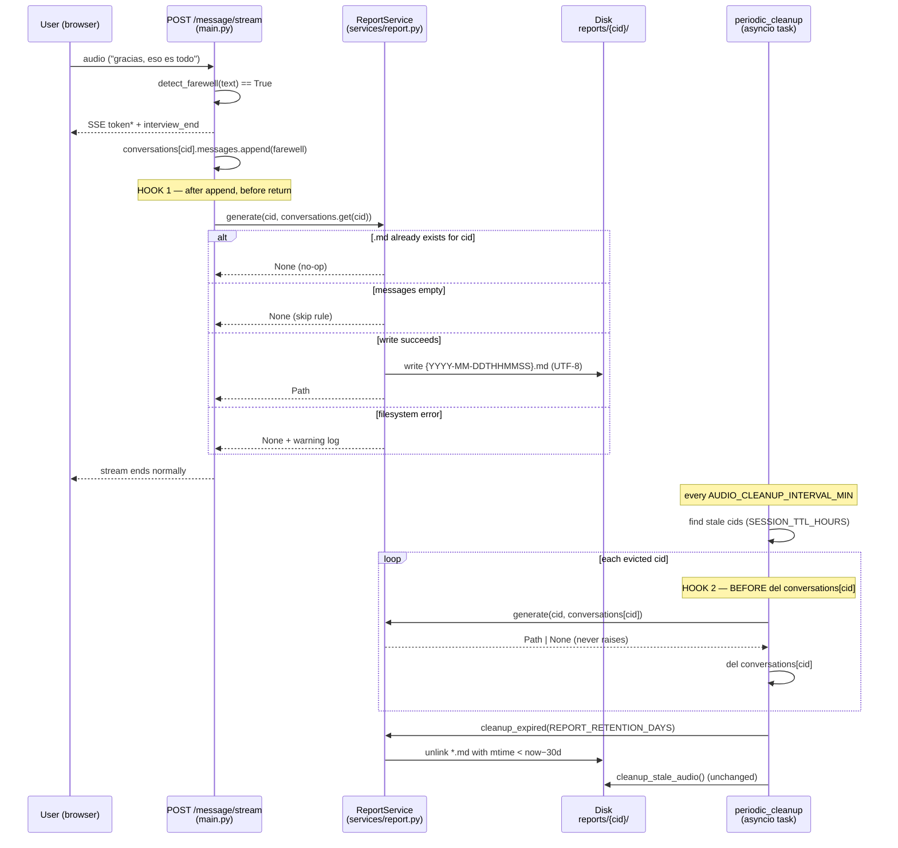

# Design: conversation-reports

Change: `conversation-reports` · Capability: `conversation-report` · Status: draft
Specs: [specs/conversation-report/spec.md](specs/conversation-report/spec.md)
Scope center: `packages/coding-agent` N/A — this repo is InterviewTTS; scope centers on `backend/`.

---

## 1. Executive summary

Add a post-hoc Markdown transcript dump of every finished mock interview. A new
`backend/services/report.py` exposes a `ReportService` that renders the in-memory
`conversations[cid]` state (`messages`, `created_at`, `last_activity_at`) into
`reports/{conversation_id}/{ISO-timestamp}.md` — zero LLM calls, no HTTP surface. Two hook calls
are added to `main.py` (farewell branch + TTL eviction loop), and report retention pruning joins
the existing audio-cleanup sweep. All filesystem work degrades gracefully: failures log warnings
and never break the SSE stream or the cleanup loop.

Estimated implementation: **~250–300 lines** including tests (service ~90, hooks/config/gitignore
~20, tests ~140).

## 2. Affected service modules

| Module | Change |
| --- | --- |
| `backend/services/report.py` | **New** — `ReportService` (only new service module) |
| `backend/main.py` | 4 additive edits: instantiate service, mkdir at startup, farewell hook, eviction hook, cleanup wiring (see §5) |
| `backend/config.py` | Add `REPORTS_DIR` + `REPORT_RETENTION_DAYS` (see §6) |
| `.gitignore` | Add `reports/` entry (see §7) |

Unchanged by design: `conversation-engine` pipeline stages (STT/RAG/LLM/TTS), prompts, caching,
rate limiting, all HTTP routes. Reporting is strictly off the hot path.

## 3. ReportService public interface

Follows the established service style in `backend/services/*.py`: a single class, constructor takes
**plain values** (not the Config singleton), methods return values instead of raising, module-level
`logger`. Mirrors `TTSService.__init__(voice, output_dir)`.

```python
# backend/services/report.py
class ReportService:
    """Persists finished conversations as Markdown transcripts under REPORTS_DIR."""

    def __init__(self, output_dir: str | Path,
                 retention_days: int = 30) -> None:
        self.output_dir = Path(output_dir)
        self.retention_days = int(retention_days)

    def generate(self, conversation_id: str,
                 conversation_state: dict | None) -> Path | None:
        """Render one conversation to {output_dir}/{cid}/{timestamp}.md.

        Returns the written Path, or None when skipped (already generated /
        empty conversation / write failure). NEVER raises.
        """

    def cleanup_expired(self, days: int | None = None) -> int:
        """Delete *.md report files older than `days` (default: self.retention_days).
        Returns count deleted. NEVER raises."""
```

### Constructor decision

The delegated brief said `constructor(config)`; existing services (`TTSService`, `LLMService`,
`RAGPipeline`) take individual values and `main.py` wires them from `config.*`.

- **Chosen:** explicit params `output_dir`, `retention_days`; instantiation site passes
  `config.REPORTS_DIR` / `config.REPORT_RETENTION_DAYS`.
- **Rationale:** matches every sibling service; keeps `report.py` importable and testable without
  importing the global Config singleton (tests use `tmp_path` directly).
- **Tradeoff:** one extra line at the wiring site vs. hidden coupling to a global singleton.

### `generate()` data contract

Reads only these keys from `conversation_state` (the exact shape built in
`create_conversation`, `main.py:~330`):

| Key | Type | Use |
| --- | --- | --- |
| `messages` | `list[dict]` with `user_text`, `response_text` | transcript body; `len()` = turn count |
| `created_at` | ISO-8601 str | header date + duration start |
| `last_activity_at` | ISO-8601 str | duration end |

`turns` / `summary` are intentionally NOT rendered (approved assumption A2).

### Rendered format (exact)

```markdown
# Entrevista simulada — {conversation_id}

- **Fecha:** {created_at[:10]}
- **Duración:** {HH:MM:SS}   # last_activity_at − created_at, wall clock
- **Turnos:** {len(messages)}

---

**Reclutador:** {user_text}

**Gemelo:** {response_text}

---
```

UTF-8 written explicitly (`open(path, "w", encoding="utf-8")`) — Spanish text is guaranteed
non-ASCII. Duration parse failure falls back to `"desconocida"` rather than raising.

### Idempotency & timestamp strategy

- Filename: `datetime.utcnow().strftime("%Y-%m-%dT%H%M%S")` → e.g. `2026-08-25T143205.md`
  (compact ISO-8601; seconds included to minimize same-second collisions).
- **Collision behavior:** idempotency is checked *before* rendering — if
  `(cid_dir).glob("*.md")` yields any file, generation returns immediately (`None`). The presence
  of any `.md` for the cid IS the "already-generated" marker; the timestamp is therefore cosmetic
  metadata, not a uniqueness key. This makes farewell-vs-eviction races safe: first writer wins,
  second caller is a no-op.
- `mkdir(parents=True, exist_ok=True)` on the cid dir only after the idempotency check passes.

### Empty-conversation skip rule

Per the **approved spec** ("Empty conversation is skipped"): if
`not conversation_state.get("messages")` → return `None`, write nothing. This supersedes proposal
assumption A3 (header-only report for empty evictions); the spec scenario is binding.

### Error-wrapping contract

Every filesystem operation inside `generate()` and `cleanup_expired()` runs inside
`try/except Exception` → `logger.warning("Report generation failed for %s: %s", cid, e)` → return
`None` (or partial count for cleanup). No custom exception types; callers need no handling code.

**Must never propagate into:**

1. The SSE generator (`event_generator`) — a raise there aborts the client's stream mid-response.
2. The `periodic_cleanup` loop — a raise would skip remaining evictions and audio cleanup for
   that tick.

Both call sites additionally sit inside their own try/except as defense-in-depth (§5), but the
service itself guarantees no-raise so callers stay dumb.

## 4. Sequence diagram — conversation end → report lifecycle



Startup path (lifespan): `REPORTS_DIR.mkdir(parents=True, exist_ok=True)` →
`report_service.cleanup_expired()` → `cleanup_stale_audio()` → spawn sweep.

## 5. Exact hook insertion points in `main.py`

All four edits are additive; no existing statement is modified or reordered except where noted.

### 5.1 Service instantiation (module top)

Next to the other service constructions (`tts_service = TTTSerivce(...)`,
`rag_pipeline = RAGPipeline(...)` block, ~lines 100–115):

```python
from backend.services.report import ReportService
...
report_service = ReportService(
    output_dir=config.REPORTS_DIR,
    retention_days=config.REPORT_RETENTION_DAYS,
)
```

### 5.2 Startup: directory + initial prune

In `lifespan`, adjacent to `config.AUDIO_DIR.mkdir(parents=True, exist_ok=True)`
(**line ~147**) and `cleanup_stale_audio()` (**line ~150**):

```python
config.REPORTS_DIR.mkdir(parents=True, exist_ok=True)   # next to line 147
...
cleanup_stale_audio()
report_service.cleanup_expired()                        # next to line 150
```

### 5.3 Farewell branch hook

Farewell branch spans **~lines 577–595** inside `event_generator()`. The farewell exchange is
appended to `conversations[conversation_id]["messages"]` at ~lines 586–593, followed by `return`.
Insert **after the `messages.append({...})` closing paren, immediately before the branch's
`return`** (~line 595):

```python
                    # Post-hoc report — must never break the SSE stream
                    report_service.generate(
                        conversation_id, conversations.get(conversation_id)
                    )
                    return
```

Placement rationale: after the append so the farewell turn itself is in the report (A2); using
`.get()` so an already-evicted session yields `None` state → clean skip instead of KeyError.

### 5.4 TTL eviction hook

`periodic_cleanup` eviction block spans **~lines 190–202**. Current body of the loop:

```python
for cid in stale_ids:                       # line ~197
    logger.debug("Evicting stale conversation: %s", cid)
    del conversations[cid]                  # line ~199
```

Insert generate **between the log line and the deletion** (state must still exist):

```python
for cid in stale_ids:
    logger.debug("Evicting stale conversation: %s", cid)
    try:
        report_service.generate(cid, conversations.get(cid))
    except Exception as e:                  # defense-in-depth; service already swallows
        logger.warning("Report on eviction failed for %s: %s", cid, e)
    del conversations[cid]
```

### 5.5 Sweep cleanup wiring

Inside `periodic_cleanup`, next to `cleanup_stale_audio()` (**line ~213**, already inside its own
try/except):

```python
try:
    cleanup_stale_audio()
except Exception as e:
    logger.error("Audio cleanup failed: %s", e)
try:
    report_service.cleanup_expired()
except Exception as e:
    logger.error("Report cleanup failed: %s", e)
```

## 6. Config additions (`backend/config.py`)

Following the `Config.__init__` conventions — env override via `os.getenv` with typed default;
paths resolve off `BASE_DIR` like the other Paths section entries. `REPORTS_DIR` uses the
`RAG_CACHE_DIR` env-override pattern (proposal: "+ optional env override").

```python
            # Paths (append to existing Paths section, after FRONTEND_DIR)
            self.REPORTS_DIR: Path = Path(
                os.getenv("REPORTS_DIR", str(self.BASE_DIR / "reports"))
            )

            # Reports — retention window in days for cleanup_expired()
            self.REPORT_RETENTION_DAYS: int = int(
                os.getenv("REPORT_RETENTION_DAYS", "30")
            )
```

Notes:

- Default `<project>/reports/` mirrors `AUDIO_DIR = BASE_DIR / "audio"`.
- Env override enables tests/ops to redirect without touching code (same rationale as
  `RAG_CACHE_DIR`).
- No floor/validation needed beyond `int()` (a nonsense value just changes prune age; harmless for
  single-operator tooling). This differs deliberately from `SESSION_TTL_HOURS`, which guards a
  behavioral invariant.

## 7. `.gitignore`

Append to the runtime-artifacts block (next to `audio/`):

```gitignore
# Generated interview transcripts (operator-only, personal data)
reports/
```

Matches the existing `audio/` precedent: generated content containing personal conversation data
must never enter the public repo.

## 8. Test plan

Command: `python -m pytest tests/ -v` (venv interpreter, per project apply rules). External
services untouched → no whisper/openrouter/edge-tts mocks needed here.

### `tests/test_report_service.py` (unit, new fixture: `tmp_path` + monkeypatched env)

| # | Test | Asserts |
| --- | --- | --- |
| 1 | `test_generate_writes_markdown_file` | `generate("abc", state)` returns a `Path`; file exists at `{tmp}/reports/abc/*.md` |
| 2 | `test_report_header_fields` | Content contains date, `Duración:`, correct `Turnos:` count computed from `len(messages)` |
| 3 | `test_full_transcript_rendering` | 4-turn Spanish fixture → every message present as `**Reclutador:** …` / `**Gemelo:** …` verbatim (accents intact → UTF-8) |
| 4 | `test_idempotent_regeneration_noop` | Call `generate` twice; second returns `None`, mtime/content unchanged, exactly one `.md` |
| 5 | `test_empty_conversation_skipped` | State with `messages: []` → returns `None`, no directory/file created |
| 6 | `test_none_state_skipped` | `generate("x", None)` → `None`, no raise (eviction race guard) |
| 7 | `test_write_failure_degrades` | Point `output_dir` at a path blocked by a file (`monkeypatch` / make parent unwritable or replace `Path.write_text` to raise) → returns `None`, warning logged (`caplog`), no exception escapes |
| 8 | `test_cleanup_expired_deletes_old_only` | Seed two `.md` files, set mtimes old/new via `os.utime`; fresh file survives, expired removed; return value = 1 |
| 9 | `test_cleanup_custom_days_override` | `days=0` deletes even fresh reports; default uses constructor `retention_days` |
| 10 | `test_cleanup_never_raises` | Nonexistent dir / unreadable dir → returns 0, no exception |

Config tests (can live in same file): monkeypatched env `REPORTS_DIR` / `REPORT_RETENTION_DAYS`
→ re-instantiated `Config()` picks them up; defaults are `<BASE_DIR>/reports` and `30`.

### Integration touches (light, no heavy mocking)

- **Farewell flow:** build minimal `conversations[cid]` state directly in
  `backend.main`'s namespace, invoke `detect_farewell("gracias, eso es todo")` → assert truthy,
  then simulate the branch tail: call the wired `report_service.generate(...)` with the real
  app-level instance redirected to `tmp_path` via `monkeypatch.setattr(config, "REPORTS_DIR",
  tmp_path)` → report exists and stream-shaped function returned cleanly.
- **Eviction ordering:** extract-friendly assertion that `generate` is called *before*
  `del conversations[cid]` — covered by calling the same code path shape used in §5.4 against a
  stubbed `report_service` recording call order (cheap; avoids spinning the whole lifespan).
- Full-SSE-stream integration (real `StreamingResponse`) is **explicitly not attempted**: it
  requires Whisper/TTS/LLM fakes across three threads; success criterion #5 (stream completes on
  write failure) is satisfied transitively because the hook sits after the last `yield` of the
  farewell branch and the service cannot raise (tests #7/#10).

## 9. Architecture decisions summary

| # | Decision | Rationale | Tradeoff accepted |
| --- | --- | --- | --- |
| AD-1 | New `ReportService` in `backend/services/report.py`, plain-value ctor | Matches house style; independently testable | One wiring line in `main.py` |
| AD-2 | Idempotency = "any `.md` exists for cid", timestamp is cosmetic | Race-safe (farewell vs eviction), trivially greppable marker | Timestamp doesn't disambiguate multi-write attempts (none can occur) |
| AD-3 | Skip empty conversations (spec-binding, supersedes A3) | Header-only reports for phantom sessions are noise | Gaps in `reports/` listing no longer visible |
| AD-4 | No-raise service + local try/except at call sites | Belt-and-braces; SSE/cleanup isolation guaranteed | Slightly redundant exception layers |
| AD-5 | Retention prunes per-file mtime via `rglob`, mirroring `cleanup_stale_audio` | Reuses proven pattern; no manifest/index to maintain | `stat()` per file each sweep (negligible: tiny dir tree) |
| AD-6 | UTC everywhere (`utcnow` timestamps, mtime comparisons) | Consistent with existing code (`created_at`, `cleanup_stale_audio`) | Filenames show UTC, not local VPS time |

## 10. Risks & residual concerns

- **Partially-transcribed evictions:** accepted by design (spec scenario covers it); header shows
  true duration/turn count.
- **Crash between farewell append and flush:** residual risk accepted (single operator); if the
  process dies pre-write the report is lost — no recovery mechanism planned.
- **Disk growth:** bounded by 30-day sweep; reports are ~KB-scale text.
- **Non-ASCII filenames:** none — cid is `uuid4().hex`, timestamp is ASCII; Spanish lives only in
  file *content* (UTF-8 enforced).

## 11. Rollback

Revert the change set: delete `report.py`, remove the four `main.py` edit regions (§5.1–5.5),
the two `config.py` lines, and the `.gitignore` entry. No migrations, no API surface, nothing else
depends on reports; stray `reports/` dirs are inert.
